---
categories:
- AppSec
date: "2022-03-20T00:00:00Z"
description: Using MongoDB Realm triggers and functions to connect to AWS services.
img_path: /assets/img/posts/20220320
pin: false
tags:
- MongoDB
- AWS
- NodeJS
title: Building Event Driven Experiences with MongoDB Realm and AWS
showTableOfContents: true
---
Disclaimer: I am a MongoDB employee. 

Most developers by now are familiar with MongoDB, a NoSQL database that stores data as documents instead of rows. MongoDB's fully managed service product, MongoDB Atlas, comes with MongoDB Realm, which is a set of services that help facilitate mobile and web development by providing a scalable, serverless backend for your application. Realm offers a lot of services (more than we can cover in just this post), but today I wanted to focus on how to use two of them in tandem to help connect a MongoDB Atlas database into a distributed, event driven architecture that can be built on AWS.  

## Pre-requisites

Before we get started, there are a couple of things you should have setup already. These include:

1. An AWS account with an IAM user created, and an access key created for that IAM user. The user should have permissions to create, edit, and retrieve parameters from AWS Systems Manager and put objects, list buckets, and get objects from S3. 

2. A MongoDB Atlas account. It is [free to sign up](https://www.mongodb.com/cloud/atlas/register), and there is a free tier that you can use to follow along with this post. The Community version of MongoDB does not include MongoDB Realm, so this post does not apply to it. 

## Emulating an application environment

We're going to have to setup a few things to make this look and feel like an environment a real application is using. Most modern applications are not just writing data to a database and reading it back; rather, they are consuming events from/publishing events to a message queue or stream, interacting with cloud storage, and relying on slight changes to data to kick off workflows. To keep things simple, our goal will be to monitor our database for new documents that are inserted and to upload a copy of them to S3 at the exact moment they are written to the database. In our theoretical application, we are using the copy of the document to do some additional processing or analysis with an AWS service that is reading from S3. 

### Set up MongoDB Cluster

Log into your MongoDB Atlas account. Create a project to act as the container for your cluster, then create a cluster. If you want to use the free tier, choose the **Shared** category at the top of the Create Cluster page. Use a recommended, free-tier region such as `us-east-1` or `us-east-2` and then scroll down select the **M0 Sandbox** Cluster Tier. Change the name of the cluster from **Cluster0** to **Sandbox** and click on **Create Cluster**. 

### Set up the S3 Bucket

While the MongoDB cluster is creating, head over to the AWS console and login as your IAM user. Go to Amazon S3 in the AWS console and choose **Create bucket**. Give it a name like `{yourname}-event-bucket` and select the same region that you created your MongoDB Atlas cluster in. Leave the other options as the default selections and click **Create bucket** at the bottom of the page. 

### Set up parameters in SSM

In the AWS console, search for AWS Systems Manager (SSM) and navigate to the service page. Once there, select **Parameter Store** on the left hand navigation, under Application Management. Select **Create Parameter**. 

On the Create parameter page, enter `event-target-bucket` as the name for the parameter. Leave the Tier as Standard, the Type as String, and the Data type as text. Under value, enter the name of the S3 bucket you created in the previous step. 

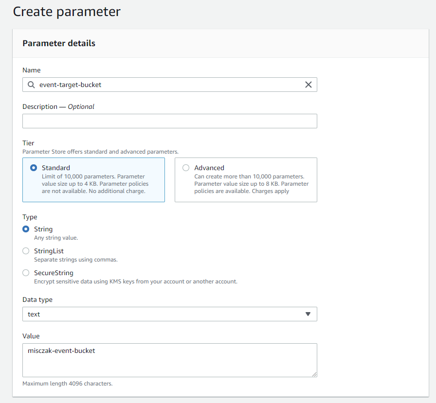

## Configuring MongoDB Atlas and Realm

### Load Data Into Cluster

Return to the MongoDB Atlas console. When your sandbox is finished provisioning, click the **...** button and choose **Load Sample Dataset**. This will give us a few databases and collections of data to use for our testing purposes.

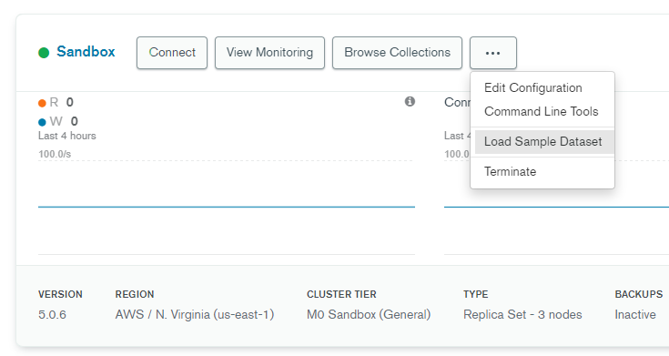

### Set up Realm App

While that data is being loaded, click on the **Realm** tab near the top of the screen. We want to select **Create a New App** and name it `AWS-Event-App`. Under "Link your Database", select **Use an existing MongoDB Atlas Data Source** and choose the Sandbox cluster you created. Then click **Create Realm Application**. 

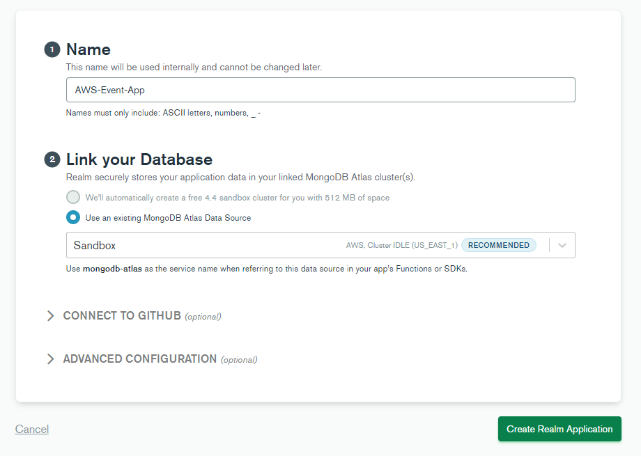

### Set up Realm Values and Secrets

In order to hook into our AWS account and use the bucket and the parameter we just set up, we have to authenticate to the account from MongoDB Realm. Since we'll be using our AWS IAM user's access key and secret key, we don't want to hardcode it into any code we end up writing or reading from source control. Therefore, we will use Realm's Values feature to securely store these values.

Realm's Values feature allows you to store two types of values - regular values and secrets. Secrets cannot be directly accessed by the Realm API; instead, they must be mapped to their own regular value in order to be able to be retrieved. This prevents you from inadvertantly exposing a secret you did not intend to. 

Click on **Values** in the left hand navigation of your Realm app. Click on **Create New Value**. For the value's name, enter `AccessKeyID`. Choose `Value` as the type, then for Content select `Custom Content` and paste in your Access Key wrapped in double quotations to mark it as a string. Then click on **Save Draft**. 

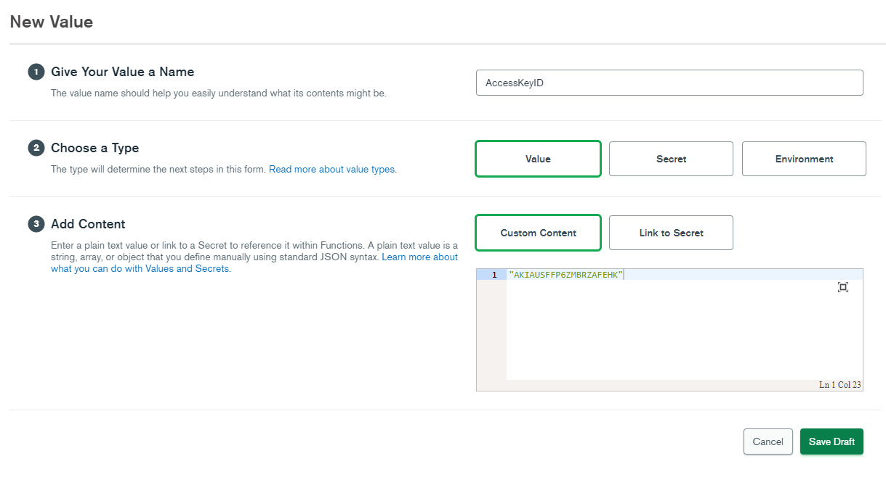

Click on **Create New Value** again. Enter `SecretAccessKeySecret` as the value name, and this time select `Secret` under Type. For the value of secret, paste in your AWS IAM user's Secret Access Key, then click **Save Draft**. 

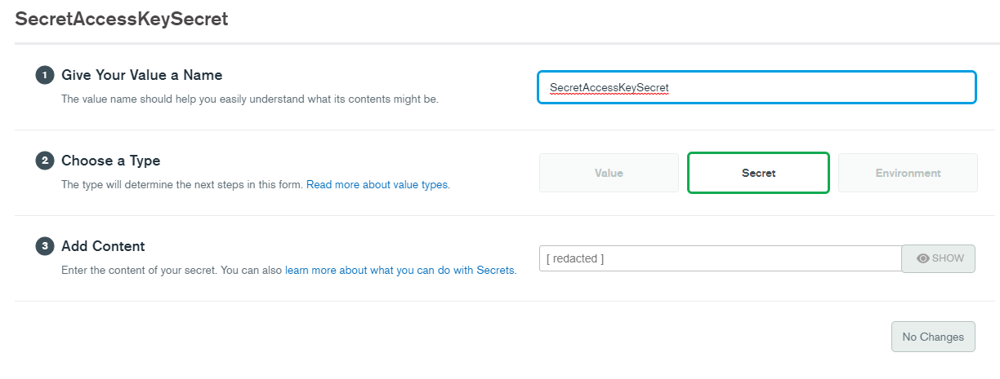

We've entered the Secret Access Key, but we cannot directly access it via the Realm API since it is a secret. We now have to create a value and map it to that secret. Click on **Create New Value** a third time. Enter `SecretAccessKey` and select `Value` as the type. Under Add Content, choose `Link to Secret` and select the `SecretAccessKeySecret` you just created. Click **Save Draft**. 

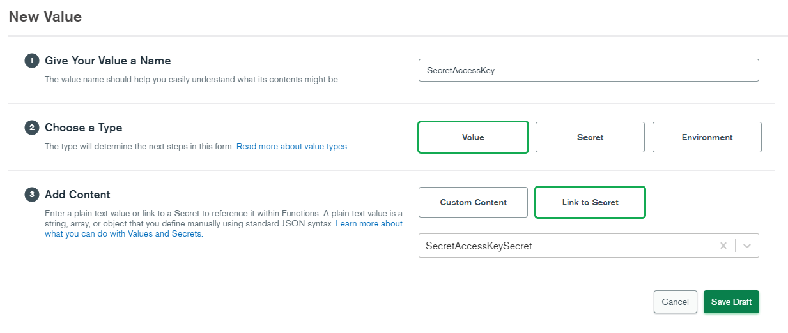

We have one more value to set up before we're done. Click on **Create New Value** again, and this time enter `Region` as the value name. Leave Type as `Value` and Add Content as `Custom Content`. In the content field, enter the AWS region where you set up your S3 bucket and SSM parameter, again wrapped in double quotations. Then click **Save Draft**. 

You may ask why we bothered with SSM at all to store the parameter of the S3 bucket name. It is true that we could also store the bucket name here in Realm's values; however, for the scope of the post we will assume the application environment has already been using SSM for parameters such as these, and therefore it will be less work for us to leave it that way. 

### Create Realm Functions

Now we are ready to start writing some code. First, let's bring in the AWS SDK which we will use in our code to make calls to the specific AWS services we will use. Select **Functions** in the left hand navigation then click the **Dependencies** tab at the top of the page. Select **Add Dependency**. On the modal that appears, enter `aws-sdk` as the package name. You can leave the version blank, but if you run into issues, you may want to come back and change the version to 2.737.0, which is what I used to write this post. When you're done, click **Add**.

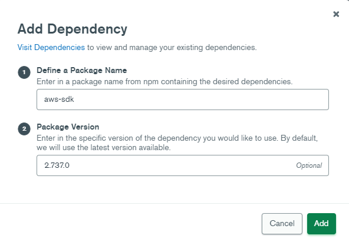

The `aws-sdk` node library should be added as a dependency. Now click **Create New Function** button in the upper right. In the Add Function page, enter `MoveDocToQueue` as the function and for now choose `System` under Authentication. Click on the **Function Editor** tab at the top, and paste this code in over what is currently there. 

```js
exports = async function(event){
  
  const AWS = require('aws-sdk');
  
  const config = {
    accessKeyId: context.values.get("AccessKeyID"),
    secretAccessKey: context.values.get("SecretAccessKey"),
    region: context.values.get("Region")
  };
  
  const SSMparams = {
    Name: 'event-target-bucket',
    WithDecryption: false
  };
  
  const doc = JSON.stringify(event.fullDocument);
  let SSM = new AWS.SSM(config);
  
  const ssmPromise = await SSM.getParameter(SSMparams).promise();
  bucketName = ssmPromise.Parameter.Value;

  const S3params = {
    Bucket: bucketName,
    Key: "queue-" + event.fullDocument._id,
    Body: doc
  };
  
  let S3 = new AWS.S3(config);
  
  const s3Promise = S3.putObject(S3params).promise();
  s3Promise.then(function(data) {
    console.log('Put Object Success');
  }).catch(function(err) {
    console.log(err);
  });
};
```

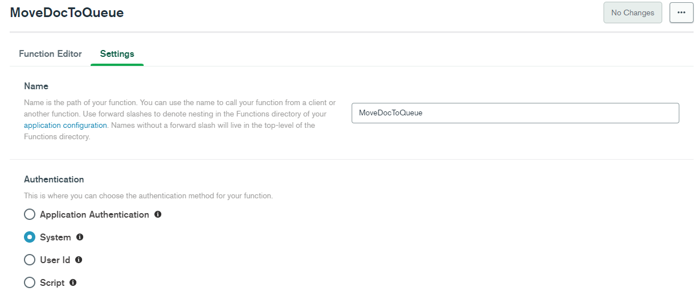

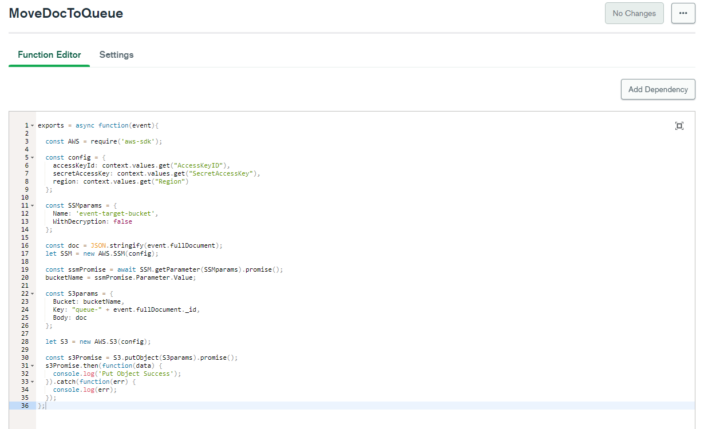

Normally with Realm functions, you can click on **Run** near the bottom right to test out the function. However, since this function will require a change event in the database to run, we will need to map it to a trigger first and modify some data to test it out. For now, click on **Save Draft**.

We now have the actual code we want to run to move documents to our S3 bucket. But how do we get it to run whenever we insert data? The answer is a Realm Trigger. Select **Triggers** on the left hand navigation, then add a new trigger.

On the Add Trigger page, enter `moveDocToQueueTrigger` as the name, then select your Sandbox cluster under Trigger Source Details. For database, select `sample_mflix` and for collection select `movies`. Under Operation type, ensure `Insert` is checked as we want this trigger to fire on every new document inserted into the sample_mflix.movies collection. Keep scrolling down and ensure that Full Document is turned to `ON`. Under Select an Event Type, choose Function and select the `MoveDocToQueue` function that we just created. Then click **Save**. 

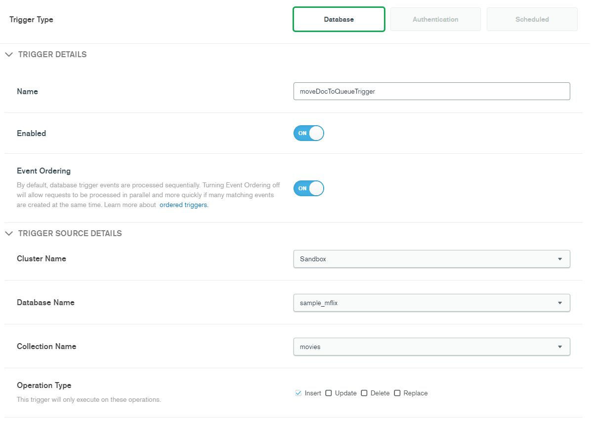

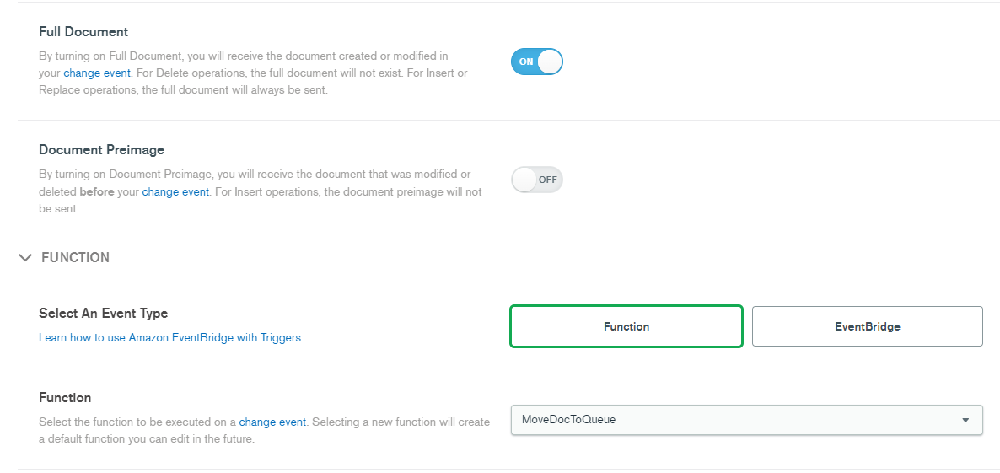

## Deploying and Testing

We are now ready to try our first test! On the blue banner at the top of the page, you can now choose to Deploy the changes to your Realm app. The values, secrets, function, and trigger should now be ready to go. Open up a connection to your MongoDB cluster and insert a new document into the `sample_mflix.movies` collection. You can do this via the [mongo shell](https://www.mongodb.com/try/download/shell), a MongoDB driver, [MongoDB Compass](https://www.mongodb.com/products/compass), or just by using the Data Explorer built into Atlas to duplicate an existing document in that collection. Keep in mind that if you are using the shell, a driver, or Compass, you will need to [add your current IP address to the IP Access list](https://docs.atlas.mongodb.com/security/add-ip-address-to-list/) in your Atlas project.

After you have inserted a new document, return to MongoDB Realm and select Logs in the left hand navigation. You should an entry in the History showing when your trigger was invoked. Expanding the entry will show you the logs from that particular function - if you set up your values and secrets correctly, you should see the log message "Put Object Success", meaning that our attempt to put the document into the S3 bucket appears to be successful. (If you do not see this output, double check your values and secrets, your IAM user permissions, and your S3 and SSM configuration.)

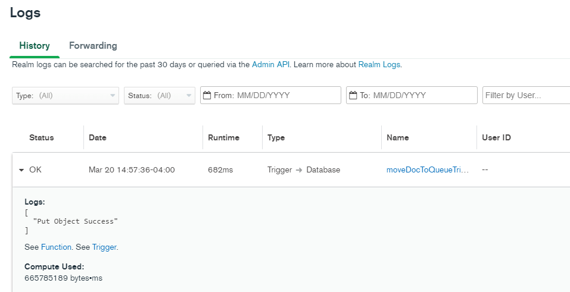

Let's double check that this actually sent the document to S3 by going back to our AWS console and navigating to the S3 service page. Find the bucket that you created at the beginning of this process and open it up. You should see an object in there starting with `queue-` and then the _id value of the document you inserted. The object is named this way because we set this as the Key value when setting up the S3 parameters in our Realm function. If you see the document, then your setup is successful!

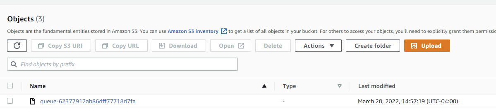

You can continue experimenting by bringing in other AWS services as well, such as sending the document to a Kinesis data stream instead of just an S3 bucket. 