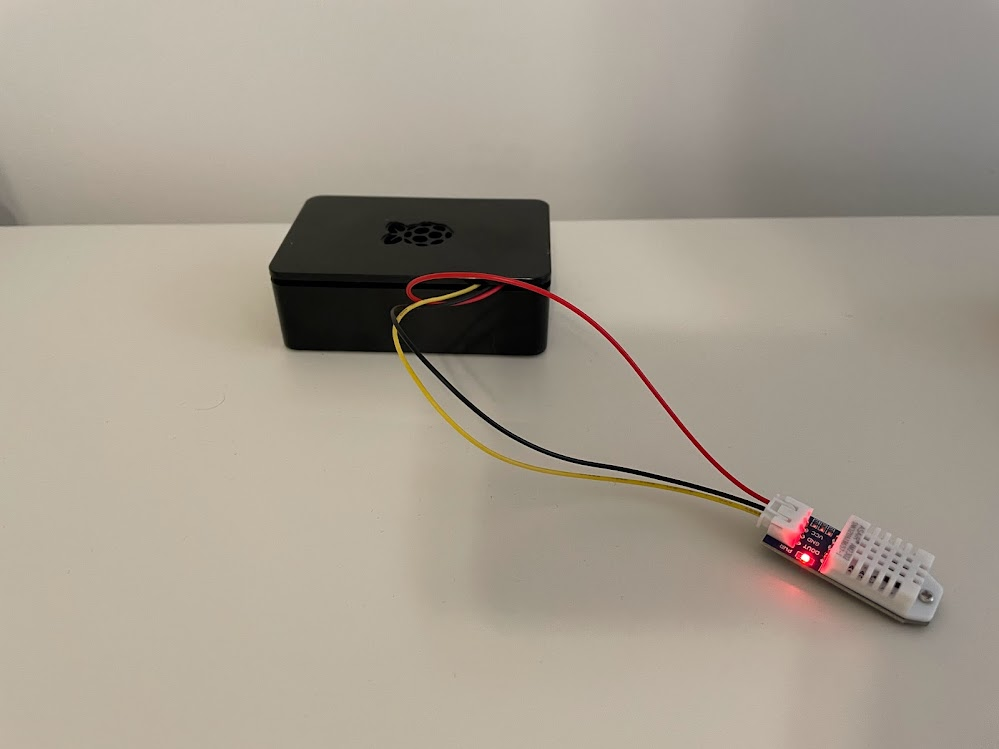
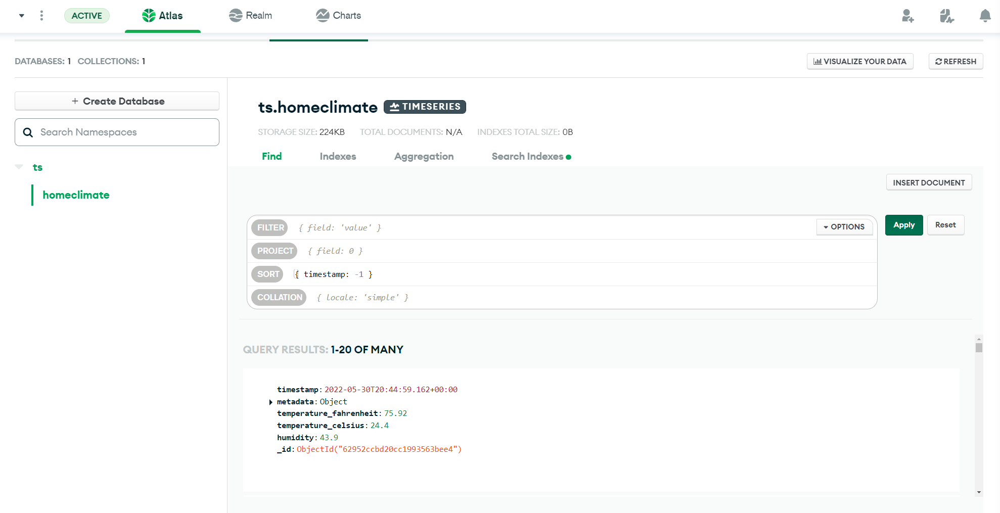
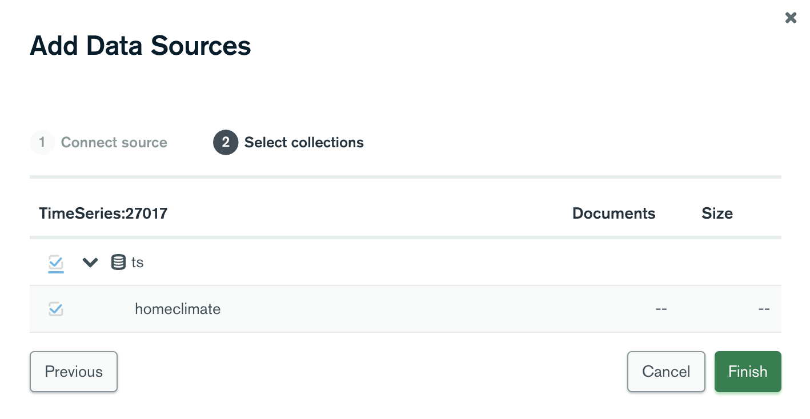
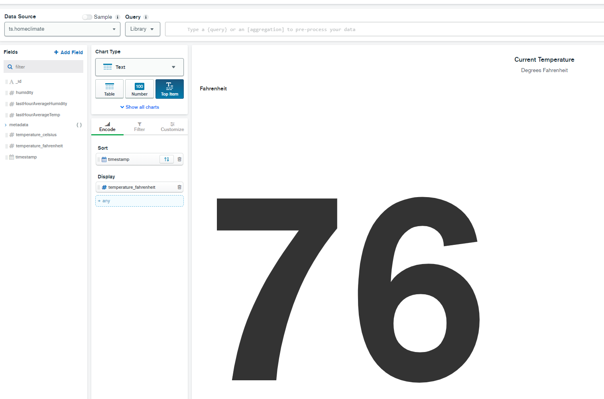
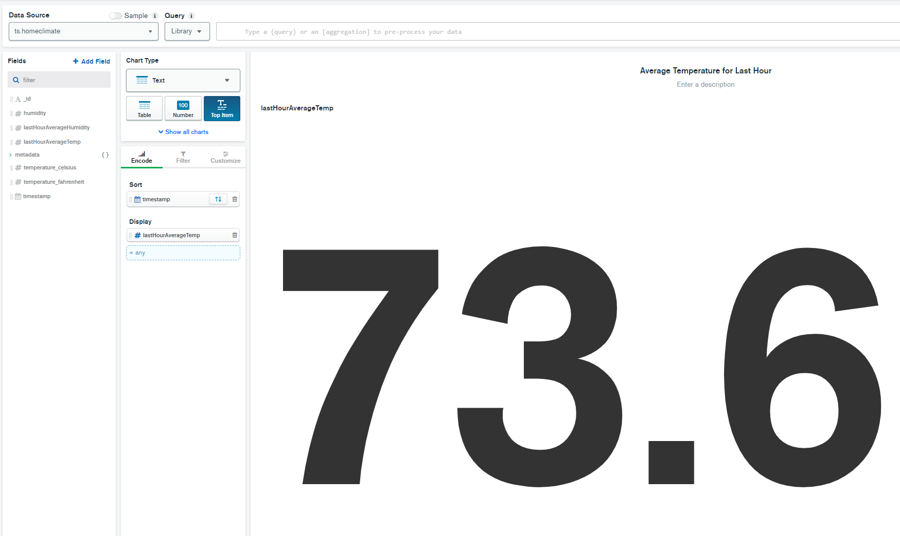
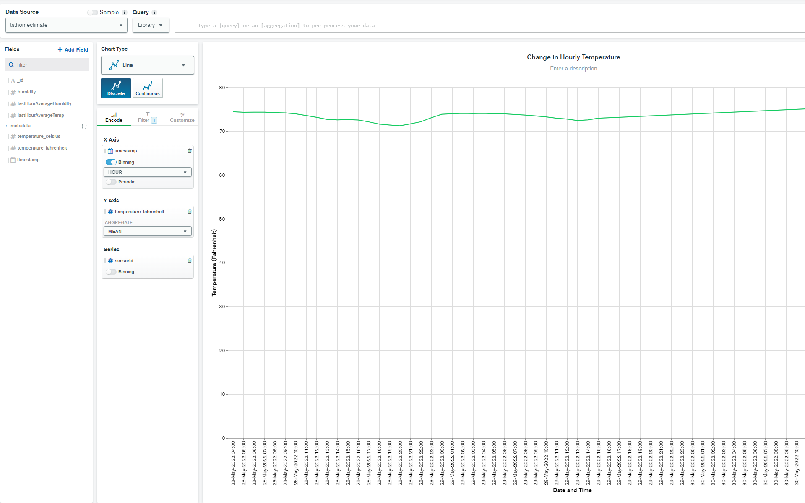
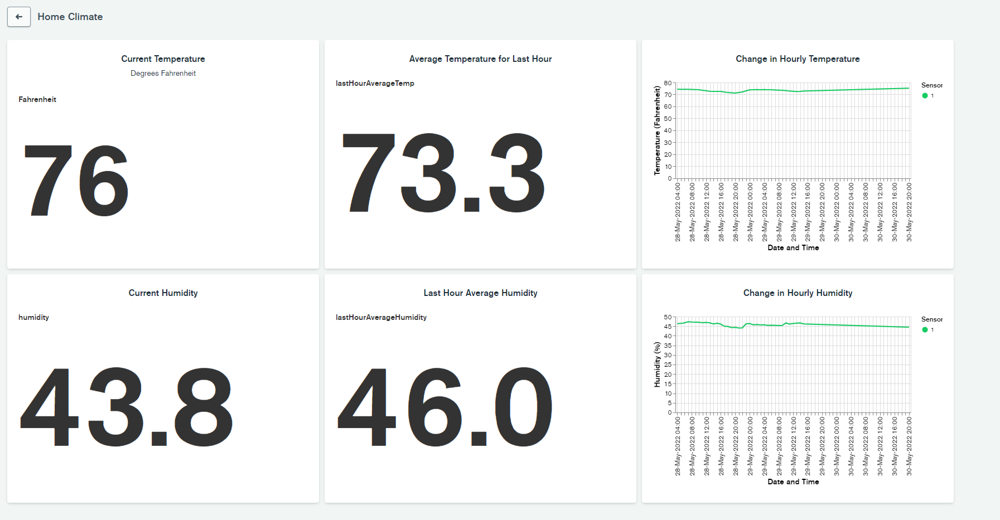

---
categories:
- AppSec
- Hardware
date: "2022-05-30T00:00:00Z"
description: Generating temperature and humidity time series data and using MongoDB's
  time series collections, charts and window functions to analyze it.
img_path: /assets/img/posts/20220530
pin: false
tags:
- MongoDB
- Raspberry Pi
- Python
title: Tracking Temperature and Humidity at Home with Time Series Data
url: posts/tracking-temperature-and-humidity-at-home-with-time-series-data
showTableOfContents: true
---
Disclaimer: I am a MongoDB employee. 

## Background

Several years back, I received a Raspberry Pi 3 Model B+ kit from [CanaKit](https://www.canakit.com/) alongside [this book](https://amzn.to/3wPWOMI). I spent some time doing the basic stuff with it (blinking LEDs, running a Linux server, etc.) but eventually turning it into a [RetroPie](https://retropie.org.uk/) and installing lots of retro games on it. After a while, I lost interest in tinkering with it and just let it collect dust in my office for a number of years. 

I was recently cleaning out my office and rediscovered both the old RaspberryPi and the book, and was thumbing through the projects when I noticed one that caught my eye. Listed in the book as Project 12, it's a simple temperature and humidity data logger that didn't really draw my interest a few years ago. Since then, however, I've moved to a new place where the bedrooms are essentially on the third floor (making them much warmer than the rest of the house). Because of this setup, one of the things that my wife and I constantly ask each other is how warm or cold it is in my son's nursery compared to the downstairs portions of the house. With this in mind, I decided to see if I could combine this simple Raspberry Pi project with the new [Time Series collections](https://www.mongodb.com/developer/products/mongodb/new-time-series-collections/) that MongoDB offers starting with version 5.0. The idea was to make a tool that would display the current conditions of my son's nursery while also giving me the ability to show how the conditions changed throughout the day and look for patterns if I felt the need to do so.

## Acquiring the Hardware

To build the temperature and humidity sensor, the book lists the following components:

* Raspberry Pi (obviously)
* Breadboard
* DHT22 temperature and humidity sensor (can substitute DHT11 or AM2302 as well)
* 4.7k ohm resistor
* Jumper wires

That's not an overwhelming number of components, but it's still a bunch of pieces that will make for a pretty messy package if you're trying to leave it somewhere in a discreet manner. You would have to connect GND on the Pi to the breadboard's blue rail, 3.3V on the Pi to the breadboard's red rail, and then connect the sensor to the breadboard and Pi as well, using the resistor on the 3.3V connection for DHT22 pin 2.

Instead, I found [this DHT22 sensor](https://thepihut.com/products/dht22-temperature-humidity-sensor) that comes with a handy 3-pin wire that you can plug directly into the Pi. DOUT goes to GPIO (pin 4) on the Pi, VCC goes to pin 1 on the Pi, and GND goes to pin 6 on the Pi. Using the case that came with my Pi from CanaKit, I was able to enclose the Pi and just had the wires escape out the top to the sensor, greatly cleaning up the overall appearance. 



## Booting the Pi

This was by far the easiest part of this project. The [Raspberry Pi OS](https://www.raspberrypi.com/software/) (formerly known as Raspbian) gives you an easy to use Linux OS. Better yet, the [Imager utility](https://www.youtube.com/watch?v=ntaXWS8Lk34) helps you set up your install so it will work exactly the way you want right out of the box. You can setup a user for SSH so once it powers up, you can connect directly to it in a headless fashion. Once you have your Pi booted up and are able to SSH into it, the real work begins.  

## Creating the Time Series Database

We'll be using the Time Series collections feature of MongoDB 5.0. The easiest way to get started is to spin up a [free tier cluster on MongoDB Atlas](https://www.mongodb.com/docs/atlas/tutorial/deploy-free-tier-cluster/) and then connect in with the new mongo shell, [mongosh](https://www.mongodb.com/docs/mongodb-shell/). You'll also want to make sure you create a database user with credentials that the script can use to connect to the database, as well as add an entry on the IP Access List to allow the connection in the first place. 

Once connected to your cluster through `mongosh`, you'll want to create the time series collection as follows:

```bash
use ts
db.createCollection("homeclimate", { 
    timeseries: { 
        timeField: "timestamp", 
        metaField: "metadata", 
        granularity: "seconds" 
    }, expireAfterSeconds: 604800 
    } )
```
The above command does the following:

* Creates a time series collection called 'homeclimate' in the 'ts' database
* Establishes a granularity of seconds for document ingestion
* Tells MongoDB that the 'timestamp' field will be used to represent the time of each reading, and the 'metadata' field will hold the information used to identify where the reading is coming from (such as what sensor)
* Makes documents in this collection expire after 604800 seconds or a little over 7 days, as we don't want to pay for an ever increasing data size and any data older than that is probably of low analytical value 

## Scripting Data Collection

The projects book linked to the [Adafruit Python DHT library](https://github.com/adafruit/Adafruit_Python_DHT) but if you go to the Github repo, you'll see that it's deprecated. The new version is [CircuitPython](https://github.com/adafruit/Adafruit_CircuitPython_DHT) which can be easily installed on the Raspberry Pi OS using pip:

```bash
pip3 install adafruit-circuitpython-dht
```
From there, it's time to actually start pulling data from the sensor with a continuously running script. Create a new Python script and edit it (I recommend using Visual Studio Code in Remote Mode to make this easier) to contain the following:

```python
import time
import board
import adafruit_dht
import datetime
import pymongo

# Initial the dht device, with data pin connected to:
dhtDevice = adafruit_dht.DHT22(board.D4)

# Set up python client for MongoDB
client = pymongo.MongoClient(<MONGODB CONNECTION STRING>)
db = client.ts
collection = db.homeclimate
sensor = 1

while True:
    try:
        # Pull the values right from the sensor device
        temperature_c = dhtDevice.temperature
        temperature_f = temperature_c * (9 / 5) + 32
        humidity = dhtDevice.humidity

        # Write a document with the temperature and humidity to the time series collection
        document = {"metadata": {"sensorId": sensor, "type": "climate"},
                    "timestamp": datetime.datetime.utcnow(),
                    "temperature_fahrenheit": temperature_f,
                    "temperature_celsius": temperature_c,
                    "humidity": humidity }

        doc_id = collection.insert_one(document).inserted_id
        print("Recorded reading to document {}".format(doc_id))
        time.sleep(10)

    except RuntimeError as error:
        # Errors will happen but need to keep going. Can make up for missed readings 
        # in the Time Series collection
        print(error.args[0])
        time.sleep(2.0)
        continue
    except Exception as error:
        dhtDevice.exit()
        raise error

    time.sleep(10.0)
```

There's a few things going on in this script:

1. First, we're setting up the actual sensor by using the driver to build a device object and saying its connected on pin 4 (GPIO) on the Raspberry Pi.
2. We're creating a connection to our MongoDB cluster and specifying the database and collection we'll be storing data in. We also setup this sensor's identifier. Since this was my first sensor, I gave it a sensor ID of 1. Future sensors will increment this value.
3. In a infinite while loop, we grab the temperature and humidity values from the sensor. Since I live in the US, I also convert this temperature to farenheit and put both temperature values alongside with humidity into a MongoDB document. Since we're using a Time Series collection, I have an embedded document with my metadata values - a sensorID and a sensor type that may come in handy in the future as I scale these out. The only other value in the document is the current UTC timestamp, which is critical for helping build the time series view.
4. After taking the reading and writing it to the database, we wait ten seconds until we do it again. This time can be adjusted up or down depending on how granular you want your time series data to be. 

If you've configured your MongoDB connection string correctly and added the entry in the IP Access List in Atlas, running this script should start writing to your Time Series collection. You should see the results after just a few seconds by going to the Collections view in Atlas:




## Using MongoDB Charts to Visualize the Data

Now that the readings are coming into MongoDB, you can use the Charts feature of MongoDB Atlas to create a dashboard and display useful information and visualizations derived from the raw data. Start by clicking on the **Charts** tab at the top of MongoDB Atlas, then select **Data Sources** in the left hand menu. On that page, click the **Add Data Source** button in the upper right and then select your cluster. It should only have one database - `ts` - and one collection - `homeclimate`. Select those and click **Finish** to set up the data source.



Now that the time series collection shows up in the Data Sources list, look to the *Pipeline* column near the right hand side. Click the **Add Pipeline** button. We're going to use the [$setWindowFields](https://www.mongodb.com/docs/manual/reference/operator/aggregation/setWindowFields/) aggregation operator to build a window function on the time series collection; specifically, we're going to run a calculation on only the readings from the last hour. 

Inside the Aggregation Pipeline Edit modal that appears, paste in the following pipeline:

```js
[
  {$setWindowFields: {
    partitionBy: "$metadata.sensorId",
    sortBy: { timestamp: 1},
    output: {
      lastHourAverageTemp: {
        $avg: "$temperature_fahrenheit",
        window: {
          documents: [-360, 0]
        }
      },
      lastHourAverageHumidity: {
        $avg: "$humidity",
        window: {
          documents: [-360, 0]
        }
      }
    }
  }
} ]
```
This window function creates two new fields for us to use in MongoDB Charts - the `lastHourAverageTemp` and `lastHourAverageHumidity`. Note that I used the original Fahrenheit temperature as the source for this new average temperature field - depending on where you're located, you may want to swap in Celsius instead. Since we're collecting readings every 10 seconds in our original script, we go back 360 readings (6 readings a minute multipled by 60 minutes in an hour). Click **Save** when you've pasted this in. 

Now click on **Dashboards** on the left hand navigation, then select the **Add Dashboard** button on the far right. Call the dashboard whatever you want. Once it's open, we'll have to add some charts. Click on Add Chart and you'll be brought to the MongoDB Charts editor. If you've never used it before, I recommend checking out the [Charts documentation](https://www.mongodb.com/docs/charts/) to check out all the features it has.

For now, we're going to add a simple chart to display the current temperature. In the upper left under data source, select **ts.homeclimate** which should be the only option available. Choose **Text** as the *Chart Type*, then select **Top Item** as want the most recent temperature reading. Now drag 'timestamp' to the *Sort* field placeholder, and click the sort button to the right of it to make sure it's in descending order. Drag `temperature_fahrenheit` to the *Display* field placeholder and you should now get the most recent reading's Fahrenheit temperature value. Click **Save and Close** at the top.



Now we can add another chart and do the same exact thing, but instead of the regular 'temperature_fahrenheit' field being used as the reading, we can use the 'lastHourAverageTemp' field that was added via the pipeline we attached to the data source. This will give us a view of the average temperature of the last hour in case the most recent temperature becomes an outlier, like if someone opens a window or starts running a heater.



Then we can add a third chart to visualize the change in temperature over time from the sensor. Add a new chart and this time, for *Chart Type* select **Line**. In the Encode tab, for the *X-Axis* select `timestamp` and turn on Binning, selecting *Hour* from the dropdown. For the *Y-Axis* select `temperature_fahrenheit`, and under the Aggregate dropdown select *Mean*. The combination of these two settings will combine all of an hour's readings into one group and take the average to represent that hour on the line chart. Finally, under *Series* we can select `sensorId` under `metadata`. While we only have one sensor currently, if we add more sensors in the future, this will show different lines for each sensor. 

Now on the Filter tab, drag `timestamp` in as the filter and select *Period*, *Previous*, and *3 Day* to limit the chart to only consider the previous three days worth of data. Again, you can adjust this period up or down to suit your needs.



If you save and close, you'll have a nice dashboard of three charts showing you some basic temperature inforamtion from your sensor. As your sensor continues writing data, the line chart will become more useful as well. You can repeat this process to create three charts with the humidity data as well to give you a full representation of readings from the sensor.

