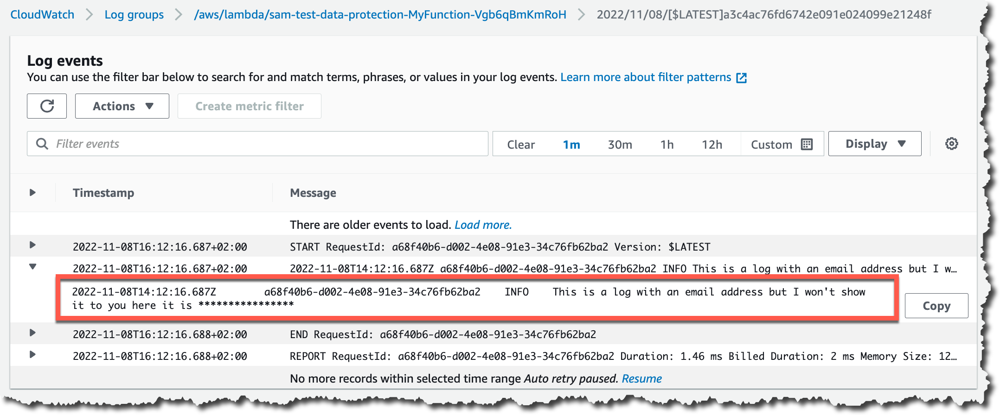
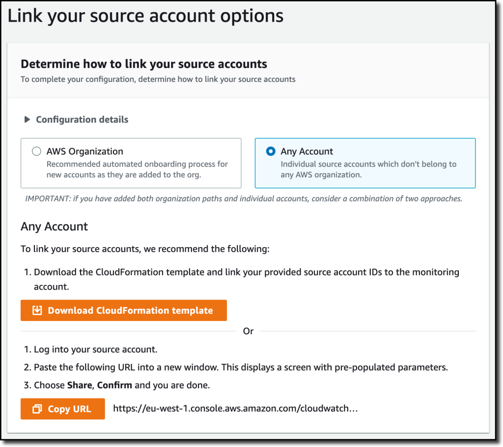
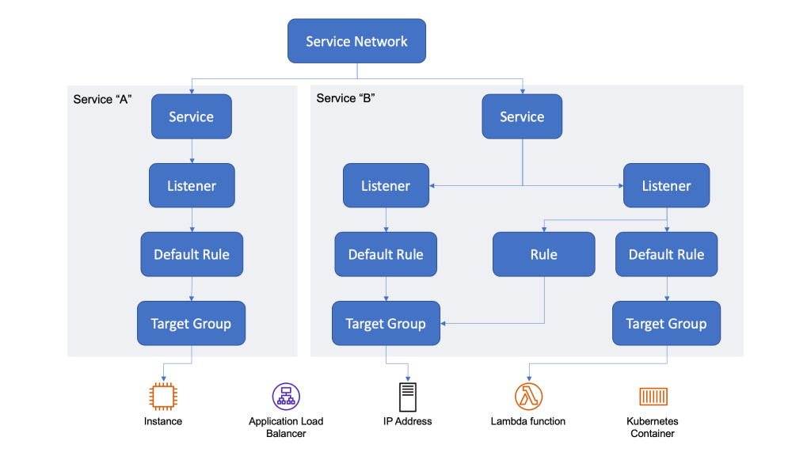
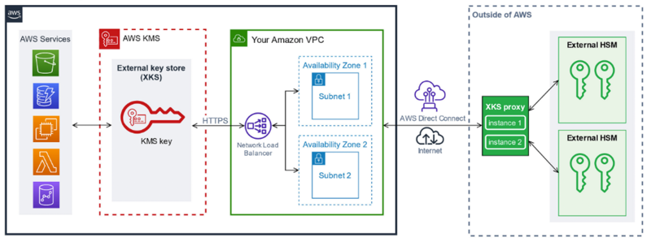

---
categories:
- Cloud Security
date: "2022-12-15T00:00:00Z"
description: Highlighting some of the announcements I found most notable in terms
  of security at AWS re:Invent this year.
img_path: /assets/img/posts/20221215
pin: false
tags:
- AWS
- Security
- Networking
title: AWS re:Invent 2022 Security Recap
showTableOfContents: true
---

The annual AWS re:Invent conference has come and gone. As usual, there is an overwhelming amount of new product launches, feature enhancements, and other service offering announcements to parse through. You could spend several days just sifting through all of the information on 'new stuff'. What I was interested this time, however, was some of the announcements for security-related services and features, especially those that solve pain points I've experienced in the past.

## Amazon Security Lake - Preview

This one seemed to get all the press and attention from the jump, and for good reason - it's an easy way to centralize data from security-related sources in both AWS and your on-premises environment. They're doing some automatic conversions to [Open Cybersecurity Schema Framework](https://github.com/ocsf/) for supposed interoperability. A number of AWS services like Route 53, CloudTrail, Lambda, S3, Security Hub, Guard Duty, and Macie will support this right away, but you can also create your own source integrations as long as you give your source the ability to write to Security Lake and invoke AWS Glue with the following policies:

* `AWSGlueServiceRole` Managed Policy
* The following inline policy:

```json
{
    "Version": "2012-10-17",
    "Statement": [
        {
            "Sid": "S3WriteRead",
            "Effect": "Allow",
            "Action": [
                "s3:GetObject",
                "s3:PutObject"
            ],
            "Resource": [
                    "arn:aws:s3:::aws-security-data-lake-{region}-xxxx/*"
            ]
        }
    ]
}
```

However, the aspect of this that really caught my eye was the [ecosystem of third-party integrations](https://docs.aws.amazon.com/security-lake/latest/userguide/integrations-third-party.html) they already available for use in the Preview. Security lake has source integrations for a lot of commonly used services like Ping Identity, Okta, Orca, CrowdStrike, Zscaler, and more - but the subscriber integrations is even more interesting. Sure, you can integrate with Splunk or Sumo Logic, but there's also large consulting firms such as PwC, Deloitte, Accenture, and others that offer to do the analysis and anomaly detection for you. Security Lake seems like it could be a boon to firms that act as Managed Security Service Providers (MSSPs) by really streamlining the ability to aggregate and provide access to data from an organization's disparate systems.

## CloudWatch Logs Sensitive Data Protection

This one is for anyone who has tried to run an App Sec program and get various application teams to go back and fix their logging. Instead of trying to convince teams to spend precious sprint cycles on fixing logging, you can just set up a data protection policy in the application's CloudWatch Log Group and specify the data that you want to have redacted. 

This approach doesn't have to be something you continuously come back and check on either - you can have alarms that fire on the `LogEventsWithFindings` metric that will tabulate how many times sensitive information was redacted in a log group. That metric could also be useful if you want to show improvement across teams as you burn down this particular area of risk. Additionally, you can offload reports of these findings to another log group, S3, or through Kinesis to the destination of your choosing. 




## CloudWatch Cross-Account Observability 

AWS accounts are often treated as an isolation boundary in organizations, with individual teams having some level of control over their own account, even if they are part of the same AWS organization. However, there may be times when you want to implement some form of log or telemetry data capture from many accounts without imposing an unncessary burden on them with bespoke tooling or excessive permissions. 

Cross-Account Observability in CloudWatch sets out to solve exactly that problem by allowing you to designate a central "monitoring account" and one or more "source accounts" that will feed the monitoring account data and logs. Instead of having to manually implement some form of regular data capture-and-forward, CloudWatch will do the plumbing for you, after you provide the list of source accounts and opt-in to the sharing from each source account. 



One caveat with this feature - it will only work for the region it is configured in. If you span multiple regions in the source accounts, you'll have to configure this in each region to feed into the monitoring account in all of those regions. 

## VPC Lattice - Preview

I've been in a lot of AWS networking discussions that involve some combination of VPC Peering, Transit Gateways, Private Endpoints, and VPN attachments. Depending on the requirements, there's often at least one good answer and design that can be solutioned out, but it will often come with some drawbacks - additional infrastructure to set up and manage, additional safeguards that have to be put into place, or even a rearrangement of existing resources in terms of VPC and subnet topology. 

VPC Lattice hopes to provide another solution for this type of problem by implementing a logical **service network** to abstract away the realities of networking and allow services in different accounts and VPCs to talk to each other via DNS. If the picture below reminds you of ELBs, you're not wrong - a lot of the same terminology and principals apply. 



There's listeners that dictate what type of traffic is expected; those listeners have rules with priority and conditions to dictate which actions to take to forward traffic to the appropriate group of targets. The *really* nice part about this service, however, is that you can associate an IAM resource policy with individual services in the network to only allow certain services and principals access to designated services. 

It's networking without networking - [and yet it's all still networking](https://youtu.be/Pex_0zg9EsE?t=112). 

## KMS External Key Store

AWS services that aim to encrypt data at rest use a key for their specific service, known as the data encryption key. However, because the service needs access to that key, it has to remain with the service itself. But this setup means that the key likely lives next to the data it's protecting - if this one area of storage is compromised, everything is lost.

To solve this problem, the data encryption key is itself encrypted by a root key that the customer manages in AWS Key Management Service (KMS). The root key is generated and stored in a hardware security module (HSM) that is tamper resistant. The key material never leaves the HSM. This works fine if you are using KMS to manage your root key and only need to encrypt and decrypt data keys for AWS services - but what happens if you want to integrate with services that don't live on AWS and don't have any connectivity to KMS?

That's where AWS KMS External Key Store (XKS) comes into play. Instead of using AWS KMS and forcing every service to talk to it, your root key can be generated and remain inside an HSM outside of AWS. For services that live outside of AWS, they can talk directly to this external HSM as they normally would. But what about services you may still be using that reside in AWS? 



With XKS, these AWS services will still make their API calls to AWS KMS; however, KMS will be aware that an External Key Store is configured, and instead forward the requests to your external HSM via an XKS proxy. This proxy is designed to translate the AWS KMS API request to a format that the external HSM expects. This setup lets you run services both inside and outside of AWS with just one location for your root keys that can remain firmly under your control.

## Summary

That's just a drop in the bucket of announcements. There was also improvements to managing controls in Control Tower, Verified Access Preview (which I have yet to dig into) that aims to allow for secure remote access without a VPN, and more improvements for finding sensitive data in S3 with Macie. Hopefully I'll have time to try out each of them before reInforce sneaks up on me later this year. 