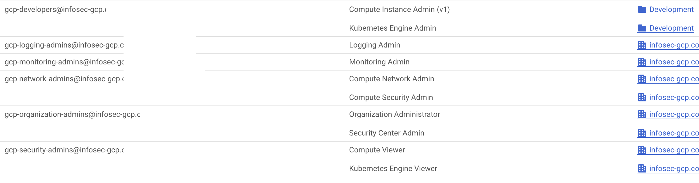
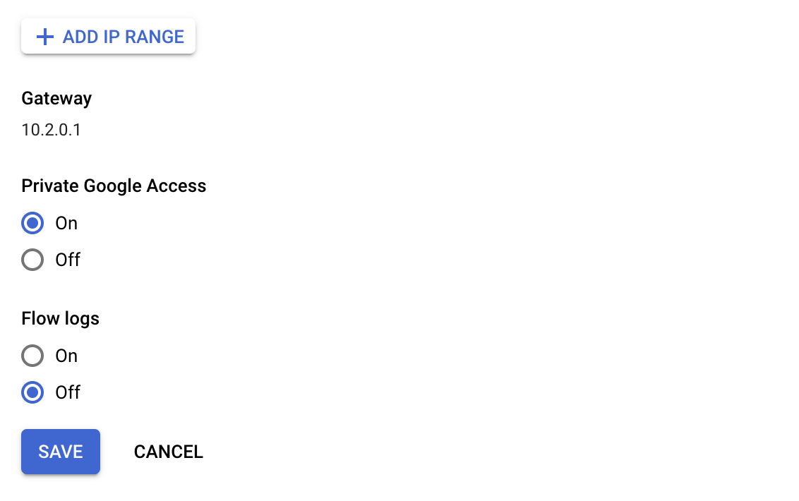
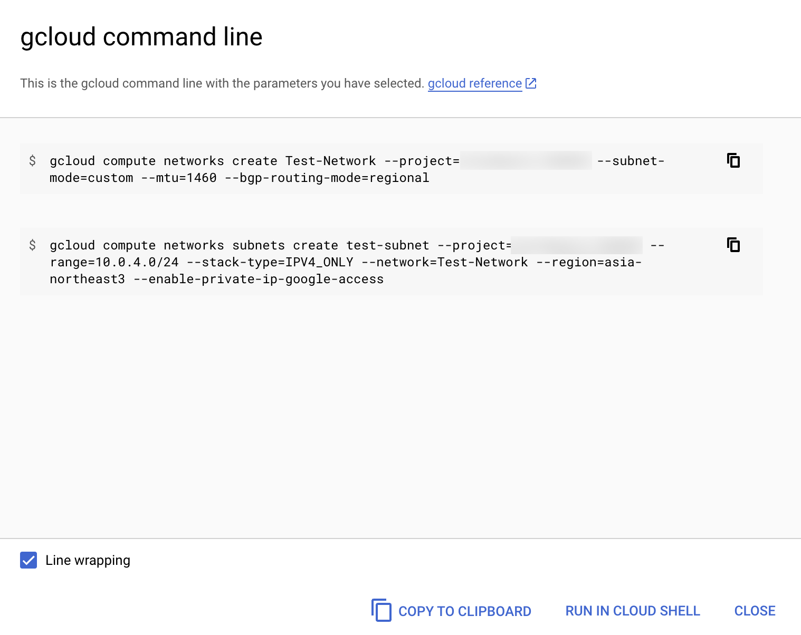
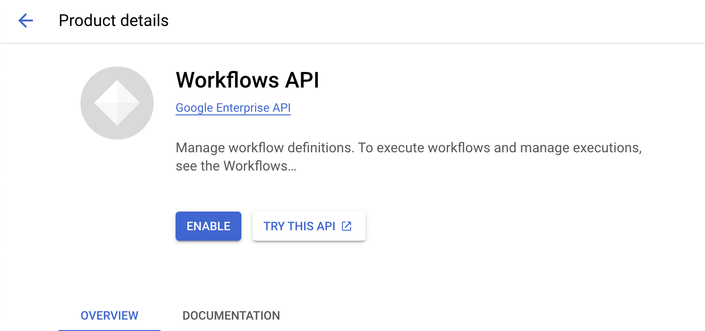

---
categories:
- Cloud Security
date: "2023-02-27T00:00:00Z"
description: Discussing my recent experience using GCP and comparing it to AWS. 
img_path: /assets/img/posts/20230227
pin: false
tags:
- AWS
- GCP
title: Building on GCP
showTableOfContents: true
---

Recently, I had to complete a project that involved running the open source tool [Cloudquery](https://cloudquery.io) to create an inventory of resources in a GCP organization. This assignment turned out to be a great introduction to learning how Google Cloud Platform works, as I had almost exclusively used AWS previously (with only minor trials in both Azure and GCP during that time). Throughout the project, I found myself often mapping certain concepts back to what they would be called or how they would be done in AWS. In doing so, I started to keep score of what I liked more than AWS and what I liked less - and now I'm finally sitting down to organize some of those thoughts. 

## What I Like More on GCP

### 1. The Organizaton-Project-Folder Hierarchy

In GCP, the top node in your environment is called an organization; under that, you can have projects, which act like AWS accounts but tend to be even more logically segmented. The reason for that strict segmentation is that you'll often place projects under folders to better organize them under a team or department or business unit. Projects allow you to easily create and control very fine grained permissions, as you can place just a few resources in a project to limit the blast radius of any permissions granted there - without having to implement lots of IAM policies. 

AWS has a concept of an organization for central management, but it is by no means a requirement to get started. You can still see its DNA as a feature that came later on, as you have to invite existing accounts to the organization. And the management account still runs the show in the organization, so you'll still have one account that quite a bit more powerful than the others. 

### 2. Almost Every Aspect of IAM

Building on the organization-folder-project hierarchy, the IAM structure in GCP immediately seems more logical once you understand how it was constructed. Every principal in GCP is tied to an email address - a byproduct of an organization requiring a domain to get started. That principal's email address can be added to any organization, folder, or project and granted permissions in that entity. These permissions can cascade from the top of the hierarchy downwards; for example, you can grant permissions at the Engineering folder level and have it apply to that principal for every project underneath it. 

Where this really becomes powerful (and convenient) is providing different permissions at different levels. For example, I may want to give the service account that my workload will run under the 'Security Reviewer' predefined role at the organization level, which will give it List permissions for nearly every service as well as Get (Read) permissions for many of them. Those permissions will cascade to every folder and therefore every project in that organization. But then, in a few specific projects, I can add the principal for that service account and grant it more specific, powerful permissions, such as Storage Object Creator to write objects to Cloud Storage Buckets in those projects. Essentially, two CLI commands are needed to set up these different tiers of permissions throughout the organization.

On the AWS side, I would most likely need to get roles or trust relationships added to every account in my organization for my workload to use to emulate this setup. And even then, the policies for those roles have to probably be tailored to specific resources because each account contains lots of resources my workload shouldn't have access to.

### 3. Less Tedious Networking (For the Most Part)

Some of the biggest differences in comparing GCP to AWS come at the network level; specifically, VPCs in GCP are global and go across regions, while subnets are regional and can go across zones. This allows me to setup a highly available workload spanning multiple while using just a single VPC. Additionally, I can spread my subnets across different zones for better fault tolerance. While you can easily emulate this on AWS with multi-region setups, there's some additional effort that goes into designing different VPCs for each region and different subnets for each zone.

The benefits become more clear when you realize that in GCP, you don't attach a CIDR block at the VPC level - instead, it's done at the subnet level. Such a setup creates an interesting tradeoff when it comes to firewall rules for these networks; while you can have a firewall rule apply for an entire global VPC and all of its subnets, that firewall rule is inherently tied to that VPC and cannot be repurposed elsewhere, like you can with security groups. 

One last note here - I love how every subnet comes with an option to enable 'Private Google Access', which just allows Compute Engine instances in that subnet to reach the external IP addresses of GCP services even if they only have internal IP addresses. This is a really simple option to toggle without having to worry about setting up a VPC endpoint, as you do in AWS. 

### 4. Focus on CLI commands, Even in the Console

For many pages that I visited in the console to create a resource or change a configuration, there was an option near the bottom that allowed me to see and copy the equivalent CLI command for the changes I had just made. By putting this front and center during console use (as opposed to burying it in a reference page somewhere), it became really simple for me to just copy those commands to my personal notes, making my configuration repeatable in the future if I wanted to replicate it in another project or environment. 

## What I Like More on AWS

### 1. No domain requirement

As I mentioned above, the organization in GCP is tightly coupled with a domain, for good reason - principals and resources become entities under that domain. But this can be a pain when trying to spin up a new environment as a sandbox for your team or if you just want to start a new project that can be brought under the management of an organization at a later date. While it's easy to undestand that every principal is an email address in GCP, I found myself still preferring to just reference a principal by account number and role name. Some of the email addresses for principals in GCP can get extremely long and be very close in terms of spelling and project IDs - I once granted the permission to the the Compute Engine Service **Account** used for my workload instead of the Compute System Service **Agent**.

### 2. APIs are Already Enabled

The first time you attempt to call the API of a service in a GCP project, you'll have to *Enable* it which requires you to accept the Terms of Service and billing responsibility for the API. While this is done presumably to prevent a lower privileged user from attempting to use and consume valuable (and costly) resources in your project, it can be extremely counterintuitive, especially when you are trying to engineer and debug tools that are reaching across projects and using lots of different APIs. 

In the case of using the CloudQuery tool, I was getting lots of inconsistent results - for example, the tool was not returning any data for certain resources, like Cloud Functions, that I knew existed in the organization. You can get around this by either enabling all of the APIs in your project so that they can be used by your workload, or by granting your workload the `serviceusage.services.enable` permission so it can enable the APIs on its own as it needs to. 

### 3. No Service Account/Service Agents Confusion

As mentioned in the first item of this section, I once granted the `Compute Instance Admin` predefined role to a GCP service account in my project instead of the Compute System Service Agent. This role was required to allow my Compute Engine instances to make use of Instance Schedules, which would start and stop them at predefined times. 

The reason for this mix-up was partially due to the fact that Service Agents are hidden on the IAM page until you toggle the box labeled **Include Google-provided role grants**. I also found it counterintuitive because every other permission I needed for my workload to function correctly was granted to the service account that I had attached to the Compute Engine instance running the workload. 

I can't recall having a mix-up like this while using AWS; there is a pretty clear map of what permissions need to be granted to which roles and how you can attach that role to compute workloads (instance profile, IRSA, etc.). 

### 4. The ARN

The Amazon Resource Name, or ARN, is a unique identifier assigned to an AWS resource. An ARN can represent a role, an EC2 instance, an S3 bucket, a VPC, and so on. Maybe it is the fact that I learned AWS first, but I have become so accustomed to looking for the ARN and using that as the identifier for a resource that it felt like my toolbox was missing something without an equivalent in GCP. Instead, for some GCP resources, you'll have a name in the format of something like `projects/[PROJECT NAME]/locations/[REGION]/functions/my-function`, but that name is not as useful for you in other projects and across the organization. Whereas AWS will often ask you to provide the ARN for a resource in a permissions policy or for a principal in a trust policy, you're more likely to be splitting resources into projects in GCP. 

### 5. Private Service Connect

While Private Google Access was easier to setup for the use case of a workload in a subnet with only private IPs trying to access Google services, Private Service Connect supports the use case of establishing a one way connection between your VPC to another VPC, whether that is in your organization or another organization - such as those of service providers. This makes it roughly equivalent to AWS' Private Link.

However, where Private Link allows you to [create some pretty interesting architectures](../2022-08-16/index.md) by providing it with peering for transitive routing and sharing of endpoints, Private Service Connect endpoints used for third party services can only be accessed from within the VPC where they are created, and only by subnets in the same region. You cannot use a peering connection to "hop" to the VPC and region where the Private Service Connect endpoint lives, and then use that to travel further along to your destination in a transitive manner.

The one exception to this is that you can use a Cloud VPN to get to the VPC with the Private Service Connect endpoint; in some cases, it may be recommended to use a Cloud VPN between two VPCs if you want to share a Private Service Connect endpoint between them. Obviously, this introduces additional complexity over the Private Link setup required by AWS.

## Conclusion

All in all, I've enjoyed my time building on GCP, as it's been a great learning experience and a useful method of challenging assumptions that I've developed over time by heavily using AWS. Since I spent some time learning how it does IAM in and out, I feel pretty comfortable using it to support our current project and any future ones that may come up. 