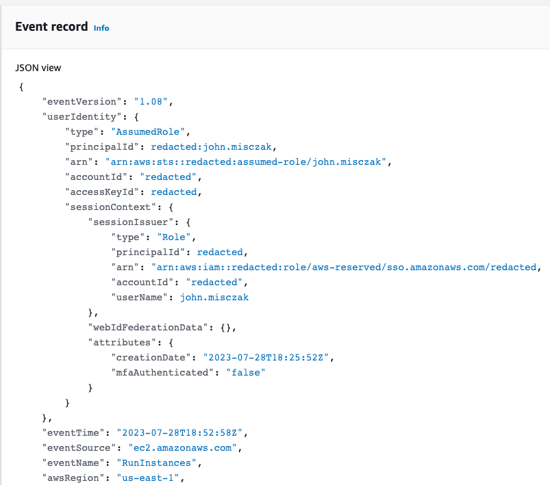
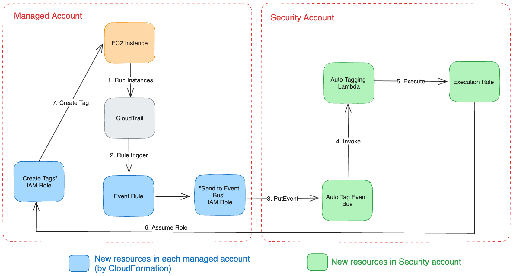
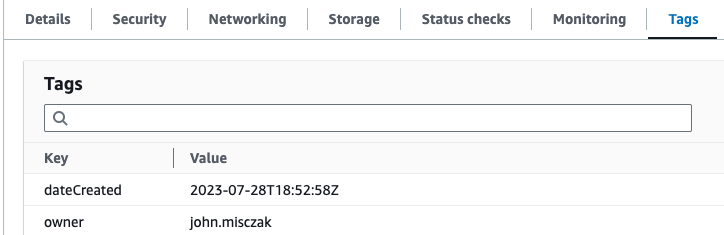

---
categories:
- Cloud Security
date: "2023-07-31T00:00:00Z"
description: A detailed write-up on extending an AWS Cloud Operations & Migrations Blog post example for automatically tagging EC2 instances in AWS.  
img_path: /assets/img/posts/20230731
pin: false
tags:
- AWS
title: Automatically tagging resources in AWS with Owner Information
showTableOfContents: true
---

## Background

One of AWS' best practices for building and managing infrastructure in the cloud is to use consistent, accurate tags for the purposes of cost management, correct owner attribution (during operations and security incidents), and even attribute-based access control. This type of tag compliance can be easier said than done, however, especially when dealing with an organization that has a number of accounts owned by different teams with very different tooling and working styles.

My team has dealt with a number of security incidents over the last year where finding the correct owner of an EC2 instance took too much time, in our eyes, at the beginning of the incident. No tags were added to the instance besides `Name`, and while CloudTrail would capture the the events that created the resource (and the principal involved), some resources predated our currently retained CloudTrail logs - meaning we did not have a record of the user that created them. 

While it is possible to require tags to be added to resources at the time of creation (otherwise blocking the creation of the resource), my team preferred not to pursue this approach for a few reasons. Implementing that type of compliance check would take a very long time to incorporate into the various workflows across the dozens of accounts for which we have oversight. Moreover, restricting resource creation until somebody enters the correct tag information can make the security team look like blockers instead of team players, which is something we are always looking to avoid.

For these reasons, I wanted to see what could be done to leverage information AWS has about our resources in order to attach tags about the owner to the instance's metadata itself without, so it would live alongside the instance for the duration of its lifetime. The preferred approach would not require any additional work on behalf of the individual or team creating the resources in the first place, and not interfere with their existing workflows. 

## Researching Previous Work
A lot of times when trying to work on projects such as this one, I end up with the thought process that somebody, somewhere, has to have solved this particular problem before. So I began my research process across the Internet, Reddit, and even the Cloud Security Slack.

What became immediately apparent is that AWS already has this information available to you; however, it's just not in a format (or part of a service) that makes it easy to extract. There is a tag called `aws:createdBy` that can be activated in the Billing Console via the management account, [after which AWS will apply it to a subset of resources](https://docs.aws.amazon.com/awsaccountbilling/latest/aboutv2/aws-tags.html).

The only issue with this tag is that it is only available in the Billing console and reports - it does not appear alongside other tags for your resources. There are some [great projects](https://github.com/wolfeidau/aws-billing-store/) out there that look to make this report information more easily queryable - but they still didn't feel like the right fit for us, as many of the projects pushed the tag information into a separate repository, with tag information about newly created resources susceptible to a delay.

Finally, I found a [post from the AWS Cloud Operations & Migrations blog](https://aws.amazon.com/blogs/mt/auto-tag-aws-resources/) from back in November 2020 that was exactly what I was looking for. It was a solution that used CloudWatch events and a Lambda function to read incoming `RunInstances` CloudTrail events and use the information from within the event to tag the newly created resource. It even had sample Python code for the Lambda function! There were only one problem with this example that prevented it from being a slam dunk - it was focused on only one account and one region. To make this solution useful in our environment, we would have to extend it to work across all of the accounts in a certain OU, and across all regions. 

## The Auto Tagging Solution, Explained
In case you don't want to click through to the AWS blog post itself, I'll briefly explain the solution. When a principal starts an EC2 instance in AWS, a `RunInstances` event is generated and logged by CloudTrail. These events contain a variety of information, including the time of the event, the principal that triggered it, the account that the instance was created in, and the region that the instance was created in. All of this information is extremely useful to capture. 



A service called AWS EventBridge (formerly CloudWatch Events) allows for rules to be created that can monitor CloudTrail for specific events, and then perform some action based on the event. The auto tagging solution includes a rule that monitors for the `RunInstances` events, and then sends the information from a captured event to an AWS Lambda function. This Lambda function reads the information in the event (mostly the instance ID and principal information), and then uses that information to apply a tag to the instance with the information about the principal. 

The chief limitation of this solution, as presented in the blog post, is that CloudTrail in a given region will only capture the `RunInstances` events that happen in that region. Additionally, a Lambda function would only be able to apply tags to instances in the same account as the function itself.

## Modifying the AWS Example
The first problem - that the example solution only covered a  single region - can be solved easily enough. Whereas the example used a single Event Rule, we would have to end up deploying the same rule in every region (of every account) that we planned on supporting as part of this solution. This requirement could be met by running a CloudFormation StackSet that created the rule in each region that each account uses. 

The second problem - that the example focused on just one account - was a little trickier to think about. Event rules can send events to Lambda functions only in the same account as the rule. We needed a way to send events from other accounts in the organization to our account, and then another mechanism to apply the tags back onto the correct instances in those various accounts. 

We ended up creating an event bus in our Security account, solely for the purpose of receiving these resource creation events from other accounts. Each event rule would send their events to this event bus instead of directly to a Lambda function. The bus, in turn, would be the doorway to our Lambda function, as it would live in the same account as the function itself. 

Next, we created two IAM roles in each managed account. One role has the `PutEvent` permission, used by the Event Rule to send events to the event bus in the Security account. The second role has the `ec2:CreateTags` and `ec2:DescribeVolumes` permission, and its trust policy allows our Lambda's execution role to assume it. CloudFormation is again used to help deploy these to all accounts in scope. It's best to deploy the CloudFormation for creating the IAM roles first, as you can then reference the `PutEvent` role in your CloudFormation for deploying the Event Rule itself. 

Lastly, we added permissions to our Lambda execution role; namely, a policy to assume the auto tagging role in any account:

```json
{
    "Statement": [
        {
            "Action": [
                "sts:AssumeRole"
            ],
            "Effect": "Allow",
            "Resource": "arn:aws:iam::*:role/auto-tag-role",
            "Sid": "ResourceAutoTaggerAssumeRole"
        }
    ],
    "Version": "2012-10-17"
}
```

Once the Lambda function was invoked, it would mostly use the code provided by the AWS blog post example. However, we modified a couple of key areas. We used the source code from the [blog post example GitHub repo](https://github.com/aws-samples/resource-auto-tagger) and set about modifying `resource-auto-tager.py`. In the `lambda_handler` function, we added some code to pull the account ID and region from the CloudTrail event:

```python
# Parse the passed CloudTrail event and extract pertinent EC2 launch fields
    event_fields = cloudtrail_event_parser(event)
    accountId = event_fields.get("account_id")
    region = event_fields.get("region")
    log.info(f"Instance created in Account: {accountId} in region: {region}\n")
```
We then pass `accountID` and `region` to the `set_ec2_instance_attached_vols_tags` function, alongside the `ec2_instance_id` and `resource_tags` as seen in the example. Once inside that function, we use the `account_id` to assume the IAM role that we deployed to every account for the purposes of applying the tags, and build an EC2 client object on the back of that assumed role session and the region. 

```python
def set_ec2_instance_attached_vols_tags(ec2_instance_id, resource_tags, account_id, region):
    try:
            # First assume the role created in the account that has permission to tag the resources
            log.info("Attempting to assume role in target account\n")
            assumed_role_response = sts_client.assume_role(
                RoleArn=f"arn:aws:iam::{account_id}:role/auto-tag-role",
                RoleSessionName="auto-tag-session"
            )
            assumed_role_session = boto3.Session(aws_access_key_id=assumed_role_response['Credentials']['AccessKeyId'],
                        aws_secret_access_key=assumed_role_response['Credentials']['SecretAccessKey'],
                        aws_session_token=assumed_role_response['Credentials']['SessionToken'])
            
            assumed_role_ec2_client = assumed_role_session.client("ec2", region_name=region)
            log.info("Assumed role in target account successfully\n")
```

Because we have used CloudFormation to deploy the same role to every account, it will be waiting for us, no matter which `account_id` gets passed in here and used as part of the ARN. And because the Lambda's execution role is trusted by each of those roles in the various accounts, it will be able to assume it without issue. The rest of the code is almost entirely unmodified. 

Stepping back and looking at the complete solution, it can be summarized by this diagram:




## Applying the Service Control Policy
Once the tags are created, we want to prevent someone from removing them, either accidentally or in an attempt to cover their tracks. This can be handled by a pretty straightforward service control policy (SCP) that just blocks the tags that you have decided to apply. In this case, we denied the `ec2:DeleteTags` action for the `owner` and `dateCreated` tags, and attached it to the OU of accounts where we would deploy the solution.

```terraform
data "aws_iam_policy_document" "auto_tag_delete_policy" {
    statement {
        effect          = "Deny"
        actions         = [
            "ec2:DeleteTags"
        ]
        resources       = ["*"]
        condition {
            test        = "ForAnyValue:StringEquals"
            variable    = "aws:TagKeys"

            values      = [
                "dateCreated",
                "owner"
            ]
        }
    }
}

resource "aws_organizations_policy" "prevent_auto_tag_delete" {
    name                = "prevent-auto-tag-modification"
    description         = "Prevents removal of tags automatically applied by InfoSec"

    content             = data.aws_iam_policy_document.auto_tag_delete_policy.json
}

resource "aws_organizations_policy_attachment" "managed_ou"{
    policy_id           = aws_organizations_policy.prevent_auto_tag_delete.id
    target_id           = var.managed_ou
}
```

## Results and Additional Considerations

Once everything was in place and enabled, tags began being automatically applied to our EC2 instances as they were created. 



Through an extensive testing and monitoring process, I learned a few things and wanted to point out some additional things to keep in mind:

* Regions further away from where your event bus and Lambda function are will take a few seconds longer to have tags applied to them, due to round trip times. Make sure you adjust the default Lambda timeout threshold to something like 3 minutes just to make sure you're not losing any tagging due to a slightly delayed event.
* While the SCP prevents someone from deleting the tags, it does nothing to stop them from modifying them. Overwriting tags falls under the `ec2:CreateTags` permission, which is what is used to apply these tags in the first place. Therefore, it would be trivial for someone to edit the `owner` tag after the fact to cover their own tracks. It is recommended you combine this solution with a tool or service that takes routine inventory snapshots of your instance fleet, such as [CloudQuery](https://www.cloudquery.io/) so that you can track changes to tags over time.
* We actually ended up adding an additional tag called "WhatIsThis" with a value that was a URL that pointed to a page on our internal security wiki explaining what auto-tagging was and why it was being applied to resources. While we sent out communications to the account owners and administrators prior to rolling the solution out, there was still going to be some users who would be confused why certain tags were being applied to instances that they had created. Depending on your organization's culture, it may be a good idea to include something like this to prevent a torrent of emails or Slack messages inquiring about the tags.
* If your organization has teams already using infrastructure as code to manage their resources, they may need to add some configuration to ignore these tags as sources of drift. For example, Terraform has an `ignore_tags` [configuration block for the AWS provider](https://registry.terraform.io/providers/hashicorp/aws/latest/docs#ignore_tags) that will allow the automatically applied tags to be ignored. 
* For accounts that routinely spin up large numbers of EC2 instances at the same time, make sure you review the current rate limits and quotas for the `DescribeInstances`, `CreateTags`, and `DescribeVolumes` API calls, as you can quickly hit the rate limit when large numbers of resources are created concurrently. 
* Although this solution works great for newly created EC2 instances, it does nothing for instances that already exist. For those use cases, you're probably better off using something like [Mark Wolfe's excellent project](https://github.com/wolfeidau/aws-billing-store/) that automates pushing Cost and Usage report information into an Athena table.

It is my hope that this post helps others fill in this gap in their own AWS security and compliance posture. I'm always happy to discuss this solution, especially ways it can be improved, if you wish to [reach out](../../contact).


