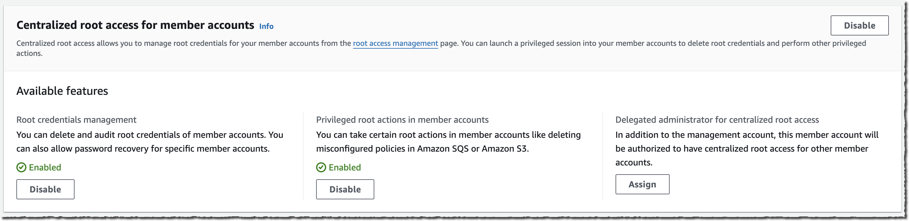
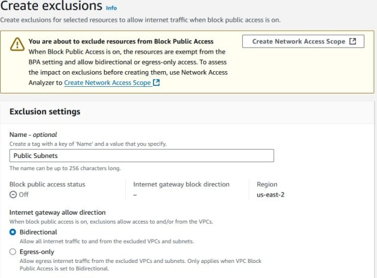
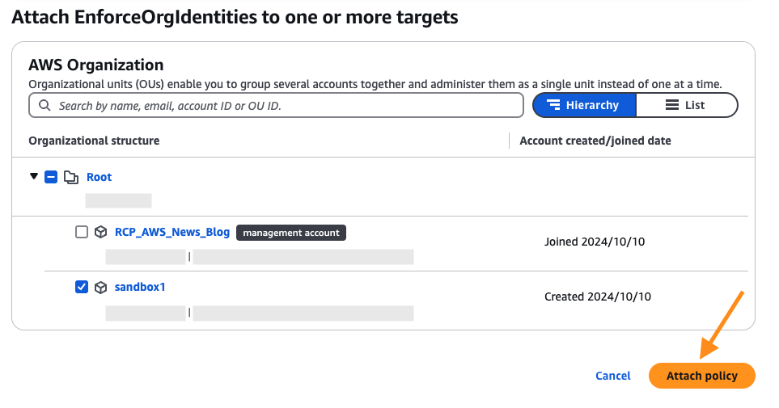

---
categories:
- Cloud Security
date: "2024-11-20T00:00:00Z"
description: A recap of all of the new AWS announcements this week leading up to re:Invent.     
img_path: /assets/img/posts/20241120
pin: false
tags:
- AWS
title: Recapping the Biggest Pre:Invent Announcements
showTableOfContents: true
---

## Introduction
While AWS re:Invent doesn't officially kick off until December 2, we are now officially in the lead up to the event, a time that often seea a flurry of new feature and service announcements. While these announcements are often overshadowed by new products that debut at the conference, they are often just as important (if not more so) to the work I do every day. This week has been the strongest example of this trend to date, with several announcements that made me genuinely excited. In the interest of processing that enthusiasm, I decided to write a recap of what I view to be the biggest ones. 

## Centrally Managing Root Access for Customers Using AWS Organizations

[Blog Post](https://aws.amazon.com/blogs/aws/centrally-managing-root-access-for-customers-using-aws-organizations/)

If you've gone through the AWS Trusted Advisor journey with your account team, you're most likely familiar with one of the automated findings being that your accounts' root users are not configured with MFA. This finding was an example of AWS' own framework not really keeping up with the practices that most security teams were pursuing; that is, not enabling root user accounts at all for any new accounts added to your AWS Organization. Even in these mature environments, there were some accounts that predated the arrival of the AWS Organizations feature, which meant that root users did exist, and the credentials still existed *somewhere* posting some sort of risk. Often times, security teams had to go through an exercise of tracking down these legacy credentials, making sure they were stored securely, rotating them at regular intervals, and adding some form of MFA - a lot of work for something that shouldn't really exist anymore, but was still needed for actions like unlocking S3 bucket policies. 

This new feature allows a security team to simply remove root user credentials from all accounts in their AWS Organization, block any attempt to 'recover' them in the future (by authorized or unauthorized party), and use short-lived **root sessions** to still perform the actions that require root access, preserving compatibility. Put together, these feature enhancements support the existing best practices (namely, avoiding IAM users and always choosing short lived sessions with roles), finally bringing privileged user management in alignment with regular user management. I would expect many teams to begin putting this into practice shortly if they haven't done so already. 

## Block Public Access for Amazon Virtual Private Cloud

[Blog Post](https://aws.amazon.com/blogs/networking-and-content-delivery/vpc-block-public-access/)

VPCs are an essential component of any AWS account, allowing for multiple workloads in a single AWS account to maintain network isolation. Traffic in and out of VPCs can be governed in a few different ways, with security group rules typically being the most popular mechanism for teams to use. One of the problems with that approach, however, is that security group rules cannot be controlled proactively with Service Control Policies, unlike many other areas prone to misconfigurations in AWS. This gap forces teams to often be reactive when it comes to dealing with overly permissive security groups.

Block Public Access gives security teams some peace of mind by providing a proactive tool to override any misconfiguration done at the individual VPC level itself. Similar to the S3 Block Public Access setting that acts as a master switch to compensate for bad bucket policies, teams can use Block Public Access for Amazon VPC to limit internet connectivity for just ingress traffic, or both ingress and egress. When blocking just ingress, any egress traffic must go through a NAT Gateway or Egress-Only Internet Gateway (for IPv6). The best part of this feature, however, is the ability to add granular exclusions to allow individual VPCs or subnets to bypass this enforcement - so you can still make exceptions when you need to while keeping the safety net intact for everything else.

This capability already has me thinking about a multitude of ways we can use this in our organization, ranging from driving compliance with network architecture standards and best practices to playing a critical role in incident response, allowing us to quickly isolate a VPC during an investigation if necessary.

## Resource Control Policies

[Blog Post](https://aws.amazon.com/blogs/aws/introducing-resource-control-policies-rcps-a-new-authorization-policy/)

At AWS re:Inforce this year, I had a conversation with a few AWS people who seemed to imply that they'd like to introduce more security boundary controls on resources themselves - and that seems to be the case with Resource Control Policies (RCPs). Following the debut of Service Control Policies (SCPs) in 2019, RCPs give your team the ability to set universal access controls right on a resource itself. These can be used to block specific actions to an entire service or on specific resources themselves. A key distinction is that SCPs get evaluated for principals trying to perform an action; RCPs get evaluated when a resource receives an access request. 

RCPs get attached to OUs and specific AWS accounts in a similar way to SCPs, and therefore should be tested just as much before rollout. However, I foresee the time to develop and implement new RCPs will be significantly quicker than SCPs in organizations, as it will be easier to scope RCPs to just protect specific resources (such as security tooling). Your security team can prevent anyone else from using, modifying or removing a resource that it uses to integrate with a configuration management database or cloud security posture management (CSPM) tool, while still allowing regular users to have full control over other resources in their account. 

## Scaling to 0 capacity with Aurora Serverless v2

[Blog Post](https://aws.amazon.com/blogs/database/introducing-scaling-to-0-capacity-with-amazon-aurora-serverless-v2/)

Okay, this one may not be as directly related to security as the others, but it fixes a personal pain point I've experienced in the past, so I wanted to highlight it. Several years ago when I stood up the first version of my team's configuration management database, we were using Aurora Serverless v1. One of the reasons we used Aurora Serverless v1 at the time was the fact that it could scale down to zero active nodes, only spinning up when needed. This allowed it to sit 'idle' for the 23 hours of the day that we weren't running the sync job for our configuration management tool, significantly reducing the cost of operating this solution. Aurora Serverless v2 had several benefits we wanted to use, such as IAM authentication, but only scaled down to 0.5 Aurora Capcity Units (ACU) per hour. We ended up migrating to a MongoDB Atlas database for this and other reasons.

Therefore, I'm glad to see that Aurora Serverless v2 now pauses after a period of inactivity, with no charges for compute while paused. This change makes it a viable option again for some smaller services and projects I want to build without worrying about throwing money away if it sits idle for prolonged periods of time. 