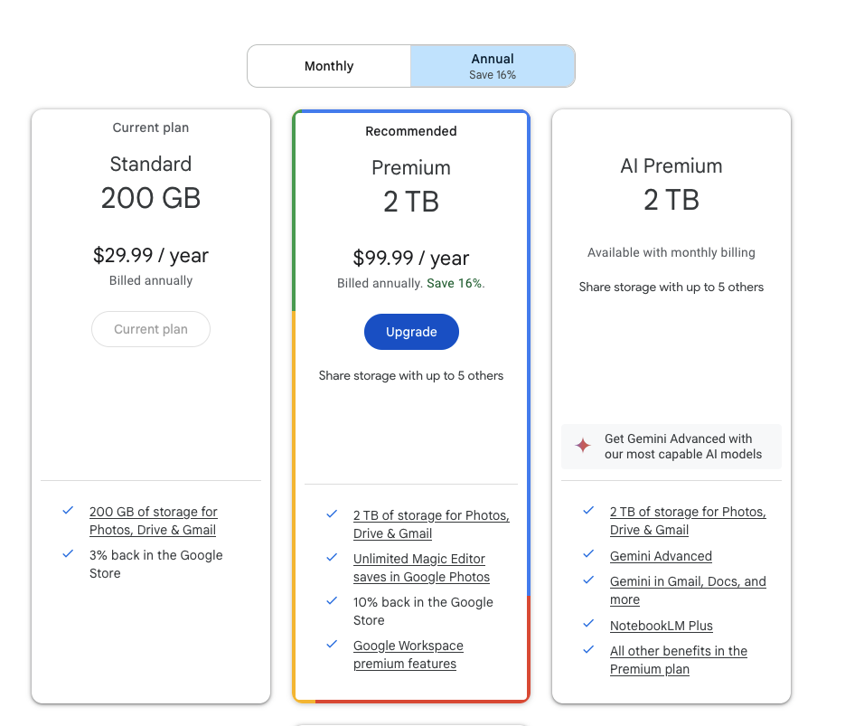

---
categories:
- Self Hosting
date: "2025-04-18T00:00:00Z"
description: A reflection on the importance of self hosting and maintaining your own stuff in the era of Big Tech.  
img_path: /assets/img/posts/20250418
pin: false
tags:
- Email
- Photos
title: The Imperial Tech Trap
showTableOfContents: true
---

## Imperial Tech
With Season 2 of Star Wars: Andor starting in just a few days, I've been rewatching the first season to refamiliarize myself with the story and characters. The season is made up of four main arcs, and the one I find the most interesting on the rewatch is the one on Aldhani, where the main character joins a group of rebels preparing for a major heist. The group has a variety of personalities, but the stand out is Karis Nemik, a true believer in the rebellion. His manifesto becomes a major plot point later on, but it's really this conversation about a piece of ancient technology that stood out to me on my second watch:

> Nemik: Old and true. And sturdy. One of the best navigational tools ever built. Can't be jammed or intercepted. Something breaks, you can fix it yourself.
>
> Andor: Hard to learn.
>
> Nemik: Yes, but once you've mastered it, you're free. We've grown reliant on Imperial tech, and we've made ourselves vulnerable. There's a growing list of things we've known and forgotten, things they've pushed us to forget. Things like freedom.

It's a Star Wars show, so he's clearly talking about the Empire's ever encroaching shadow. But it's not hard to draw parallels with our reliance on big tech in the year 2025. 

## How Did We Get Here?

For most of us, this story probably starts around 2004 or 2005 with the rollout of Gmail. It was the first big Web 2.0 mass market service that spread like wildfire and acted as an inflection point, where people went from just using Google to search for webpages and started logging into their Google account everyday to check their email. The Youtube acquisition a few years later helped deepen the reliance on Google accounts, and then Android made having a Google account a necessity for a very large group of smartphone users. 

It wasn't all Google, though. Microsoft rushed to compete on all fronts, with ~~Windows Live Mail~~ ~~Windows Live Hotmail~~ Outlook.com, Windows Phone, XBox, and even the Windows desktop operating system. Meta wasn't content with the reach of Facebook and Messenger, so they gobbled up Instagram, Whatsapp, and Oculus to extend their ecosystem. Even Apple has began doubling down on services it can sell you, attached to your Apple ID and iCloud, proliferating across all your Apple devices. 

At each step of the way, integration with other existing services from each company helped smooth over the rough spots and edges that would hamstring adoption. Bundling these services together often made Big Tech's offerings the cheapest option you can find; as I write this, I still pay for Google One's 200GB plan, which gives me space I can use across Gmail, Google Photos, and Google Drive. The data collecton and target advertising practices of many of these companies was well publicized, but the tradeoff was worth it for a long while, as the services kept improving, new services were introduced, and the costs were reasonable. 

## So What Happened?

To borrow Nemik's words, we grew reliant on it. We got comfortable. And in that, we made ourselves vulnerable. Vulnerable to ever encroaching waves of [enshittification](https://arstechnica.com/gadgets/2025/02/as-internet-enshittification-marches-on-here-are-some-of-the-worst-offenders/). Vulnerable to [continual price increases](https://9to5google.com/2025/01/15/google-workspace-price-increase-2025/). Vulnerable to no longer being able to fix things ourselves, so when something breaks [we are forced to completely replace it](https://phandroid.com/2025/01/24/googles-pixel-4a-update-is-a-prime-example-of-forced-obsolescence/). 

For many of us, we've spent two decades enrolling in more and more of these services offered by Big Tech. Two decades of handing over user data that has suddenly become walls, keeping us inside what we once considered a garden. It's much easier to slowly and gradually add your data to these services than it is to pull it all out in an organized and efficient manner. With eaching passing day and each bit of data we keep funneling into their jurisdiction, it becomes that much harder to convince ourselves to leave. 

## The Axe Forgets, But The Tree Remembers

Fortunately, there are a growing number of alternatives and pathways out of this trap. There are communities rallying  around leaving big tech behind, such as the [De-Googling one](https://www.reddit.com/r/degoogle/). People are compiling [lists of the best services and applications](https://github.com/awesome-selfhosted/awesome-selfhosted) that you can self-host on your own hardware at home or in the cloud. [Newsletters](https://next.content.town/) are popping up to rally the masses to overcome the dissatisfactions with popular technology choices. I've been spending the last few months trying many non-Big Tech alternatives out, and I wanted to recommend a few that stand out to me. 

1. **[Fastmail](https://www.fastmail.com/)** - For many years, I thought that anybody using an email service that was not Gmail was missing something. Now, I feel that way about anyone not using Fastmail. It's hard to summarize the amount of amazing features offered here, but I'll try to anyway. [Masked Emails](https://www.fastmail.com/features/masked-email/) with 1Password integration give you disposable aliases you can turn on/off at will; subdomain addressing let you customize additional emails even when sites block the well known +alias trick;  the ability to use one or more registered domains as your email address(es); and a lightning fast interface that makes you realize how slow Gmail has really become. It's affordable, their customer support is helpful and efficient, and they are exclusively focused on making the best email experience possible. Oh, and their migration features make a slow transition out of Gmail (or other email providers) absolutely painless as well.

2. **[Immich](https://immich.app/)** - This might be the best free and open source software I've ever used. It looks and feels exactly like Google Photos and can be self hosted on anything from a Raspberry Pi to a full fledged NAS. The amount of features Immich has is incredibly impressive - depending on how deep you want to go, you can add OIDC authentication, setup reverse proxies for access outside your network, configure sharing of photos and albums with family members and friends who don't have access to your server, and enjoy all the same powerful facial recognition features that you're accustomed to on Google Photos and Apple Photos.

3. **[Ente](https://www.ente.io)** - If you're not into self hosting but still looking for an exit from paying for increasing amounts of storage from Apple or Google, look no further than Ente. Built and operated by a small company with a focus on privacy, Ente offers end-to-end encryption of your photos and videos, distributing them across three clouds for high availability and redundancy. They have an incredible import tool to preserve your metadata from Google Photos. Most importantly, they also offer a self-hosting option, so if you ever wanted to stop paying them, you have an easy off-ramp that won't require a ton of photo manipulation or metadata correction in the future. 

4. **[Home Assistant](https://www.home-assistant.io/)** - Far too many smart home and IoT devices these days require Internet connections or smartphone app logins to configure, set up, and use. Home Assistant aims to reestablish your control over your home and network, letting you integrate with the ever increasing number of device manufacturers and platforms so you can establish controls and automations to your heart's content. Once again, this can be run off something as small and cheap as a Raspberry Pi.

5. **[Filen](https://filen.io/)** - This is my newest discovery but perhaps one of the most impressive. Offering cloud storage for your files (similar to Dropbox, OneDrive, or Google Drive), Filen touts its end-to-end encryption while offering to be a more user friendly alternative to its Big Tech competitors. There's a variety of sync modes that cater to all use cases, including the ability to host a local S3 server to access your actual S3-compatible storage in a more streamlined way. 

## Climb

There are plenty of options I haven't touched on, including the [full suite of Proton products](https://proton.me/) and heavier duty self-hosted options like [Nextcloud](https://nextcloud.com/). Everyone's use cases and requirements will be different, but the important takeaway is that the galaxy is brimming with options now to remove your reliance on Big Tech. Don't let the knowledge that alternatives exist be forgotten, even if you have to spend some time sorting it out and mastering it. Because once you do so, you're free. 
