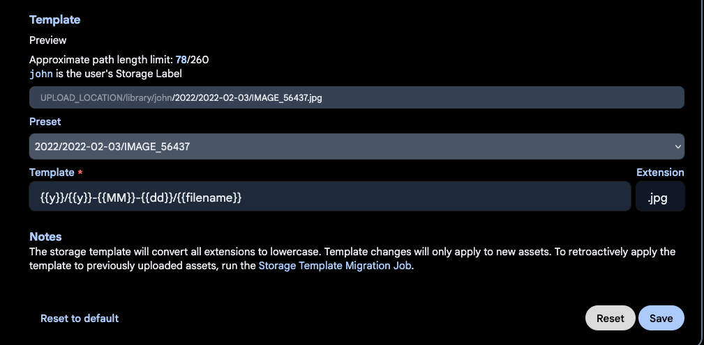

## Background
In my post last month about [rethinking my personal tech stack](https://www.misczak.com/posts/rethinking-my-personal-tech-stack/), I had mentioned that I had been using [Ente Photos](https://ente.io) as an alternative to Google Photos, but had also been evaluating Immich. I also mentioned that one day in the future I might move over to Immich after figuring out a better backup strategy for my HomeLab.

That day came this month as I had some time to figure out the last few items I needed to feel secure in using Immich as my primary photo platform, running entirely on my Beelink S12 Pro running Proxmox. 

## Requirements
Before I had kids, my photo library would fit into the free tier of basically any cloud photo service that is out there. Afterwards, it's an entirely different story - I now have thousands of photos and videos of my kids through their first few years of life. I consider this collection to be one of the most critical pieces of data I have, far surpassing old college papers and the blog posts I cobble together for this site Therefore, making sure I am being careful to protect against data corruption, data loss, and accidental public exposure is of paramount importance. The last one in particular is pretty critical, as protecting photos and videos of my kids from being used to train LLM models is one of the reasons I was looking to get away from Google Photos to begin with!

When looking to fully self-host my photos, I had three main requirements I felt like I had to satisfy before I felt comfortable moving away from Ente:

1. My photo collection cannot, under any circumstance, be exposed to the public Internet or used for model training/advertising/tracking by a company. For the purposes of facial detection, a model hosted entirely on my own devices is acceptable.
2. The solution needs to be able to scale to meet my increasing storage needs in a cost effective manner, as I only see myself taking more photos over the years. I really don't like how most cloud photo services automatically send you up to the 1 or 2 terabyte tiers once you exceed 200 GB.
3. I want to be able share individual photos/videos as well as certain albums with people who do not use the same app as me and do not have access to my home network. 

Of these, requirement two is easily met by any service that I can self-host at home. It's requirements 1 and 3 that become much more difficult to meet while attempting to match the functionality that more popular services offer.

## Setting Up Immich 

I looked up the installation instructions in Immich's excellent [documentation](https://docs.immich.app/install/requirements) and saw that the recommended approach was through Docker compose. I could set it up in a Linux Container (LXC) in Proxmox, but I decided to go for the well supported path and instead provisioned an Ubuntu VM with a static IP address, 2 CPU, 4 GB of RAM, and 40 GB of storage space. My goal is to use my Synology NAS as the storage for all of my photos and just mount the photos share to the VM, so I only need some storage in the VM itself for container images and other files. Once the VM was created, I authorized its static IP to connect to my currently empty NFS photos share on Synology and mounted it in `/etc/fstab`.

I then built my docker compose file using the [instructions](https://docs.immich.app/install/docker-compose) on the Immich, taking care to point my photo upload location to the `/mnt/photos` directory that was the mountpoint for my NFS photos share, then ran `docker compose up` to bring up the service on my network. 

Once it was running, I made an account for myself and installed the mobile app on my phone. However, I didn't login on mobile yet; instead, I wanted to do a bulk import of all of my photos before connecting my phone.

## Importing Existing Photos
Immich is a little different than most photo services in that it supports two options of adding photos to your collection - as uploads through your own account, or attached as an [external library](https://docs.immich.app/features/libraries#import-paths). It would have been easy to just include my existing photos as an external library, but this would create a weird division between photos I had before installing Immich and photos I took after installing it, which would be uploaded through the mobile app and added to my regular library.

Instead, I wanted to do a full import of all of my existing photos through my actual user account, as if Immich was ingesting them naturally. However, downloading all of my photos to my phone and then uploading them through Immich would take forever. Fortunately, there is a great utility called [immich-go](https://docs.immich.app/features/libraries#import-paths) that can take a Google Takeout file (or multiple files) and import them into your Immich library using an API key you generate in Immich's administration page. This turned out to be an incredibly fast and effective way of uploading nearly 200 GB of photos and videos into Immich without any errors or corruption issues. As part of the upload, it ended up writing my photos to the photos share on my Synology NAS, which is exactly where I wanted it. 

Once that was complete, I logged in through the mobile app and enabled mobile backup from the Recents album on my phone. Since all of my photos had already been imported into Immich, it didn't have to upload anything from my phone, bringing both endpoints in sync. 

## Immich's Jobs
Inside the Immich administration page are a number of jobs that get run when adding photos to your library or at regular intervals (such as overnight, when most people wouldn't be using the system). These jobs include grouping faces into people for easier identification across photos, analyzing text in images, and transcoding videos for better device compatibility. After the initial import, some of these jobs took a while to run, so I didn't ask too much of Immich for the next day or so. 

[](images/immichjobs.png)

If you have a GPU in the machine that you are running Immich on, you can use that for the machine learning container and chew through these jobs much quicker. I initially passed the GPU from my Beelink through to this VM to handle the initial import, then removed it so my other LXCs (like Plex) could use it instead. In the future, I may move the machine learning container to my desktop PC so it can use my fully powered Nvidia GPU there instead. 

Once these jobs were done, I turned on Immich's Storage Template feature to better sort my photos on my NFS share by date. You can get pretty deep into the customization here, but the default format worked for me - I just wanted to be able to easily drill down into a given year or month on my NAS if need be. After configuring that, I ran the Storage Template Migration job to allow Immich to re-organize the photos I had already uploaded. 

[](images/storagetemplate.png)

I also tested that my preexisting [Tailscale LXC setup](https://www.misczak.com/posts/building-out-the-homelab-proxmox-and-tailscale/#tailscale) allowed me access to my server when outside the house without exposing it to the public Internet. I turned off wifi on my phone, connected to my tailnet, and tried to access Immich through the mobile app on my phone. It worked just as planned!

At this point, I felt like I had met requirement 1 - Immich was up and running locally, with a local facial recognition model sorting photos into people. 

## Public Sharing
With my first two requirements met, I set about figuring out how to share photos, videos, and albums from my Immich library with external/public users. There is a whole focused discussion about this on the Immich discord, where users debate the best way of exposing Immich without jeopardizing the privacy of their photos. 

Immich has the ability to generate links for selected photos/videos or an entire album, which I would then distribute to people so they are able to view my media. This link needs to be publicly routable for them to be able to view the content; if my Immich server is running off an internal IP or DNS record (something like 192.168.x.x), it's not going to work. 

One option is that I could just expose Immich behind a reverse proxy to the entire Internet, but that opens up the potential for a single security flaw in Immich to expose my library. Fortunately, somebody had already recognized this problem and created something called [Immich Public Proxy](https://github.com/alangrainger/immich-public-proxy), which acts as an intermediary that I can expose to the public internet since it has no credentials or sensitive paths itself. Instead, all it can do is map external requests to internal API calls in Immich. 

This looks great, but now I needed to be able to expose Immich Public Proxy to the public internet. I could open ports on my router itself, as it only requires a single one - but I prefer not to do this if at all possible. Instead, I opted to use a feature from Cloudflare called [Cloudflare Tunnels](https://developers.cloudflare.com/cloudflare-one/networks/connectors/cloudflare-tunnel/) which allows me to place a daemon in my internal infrastructure that creates outbound connections to Cloudflare's network to route traffic as mapped in your Cloudflare DNS records.

Both Immich Public Proxy and the Cloudflare Tunnels daemon (cloudfared) can be added to a Docker network, so I added a bit more to my Docker Compose file for Immich:

```yaml
immich-public-proxy:
    container_name: immich-public-proxy
    image: alangrainger/immich-public-proxy:latest
    restart: always
    ports:
      - "3000:3000"
    environment:
      PUBLIC_BASE_URL: ${IMMICH_SHARE_URL}
      IMMICH_URL: http://immich-server:2283
    healthcheck:
      test: curl -s http://localhost:3000/share/healthcheck -o /dev/null || exit 1
      start_period: 10s
      timeout: 5s

  tunnel:
    container_name: cloudflared
    image: cloudflare/cloudflared
    restart: unless-stopped
    command: tunnel run
    env_file:
      - .env
    environment:
      - TUNNEL_TOKEN=${TUNNEL_TOKEN}
```

First, I'm passing in some references that are used to configure these services - the public share base URL I'll be using in my Cloudflare DNS records for shareable links, and the token generated by Cloudflare when creating a tunnel. Then it's a pretty straightforward configuration that points Immich Public Proxy at my existing Immich server. On the Cloudflare side, I configured the tunnel so that a CNAME record for a subdomain gets routed to my Immich Public Proxy container and port that now runs on the same Docker network as cloudflared.

[](images/cloudflaretunnel.png)

There's one last step I had to do inside Immich itself - in Administration > Settings > Server Settings, I configured the external domain with the CNAME entry I had just hooked up to the tunnel route in Cloudflare. Once that's done, any shareable link I generate in Immich should be able to be routed via the Cloudflare tunnel to my internal Immich instance, but without exposing any ports on my router or making any part of the Immich server itself publicly reachable. 

## Backups
The last thing I had to resolve was how to back all of this up in a way that made me feel confident that I could use it as my sole photo service moving forward. Immich has a great [documentation page about backups](https://docs.immich.app/administration/backup-and-restore), and even just added the ability to do restores through its web UI. In essence, there's two main things you need to worry about when backing up Immich:

1. The database that Immich uses to underpin the server
2. All of your photos and videos themselves

Immich has a built in job to create database backups, storing them in $UPLOAD_LOCATION/backups. It creates several of these over the course of ten days since they are pretty small. Combined with your actual photos and videos, this is everything you would need to restore Immich should you encounter disaster. 

Since Immich is just another VM on my Proxmox host, I configured Proxmox to back up my Immich VM every day to a secondary disk in the mini PC itself. Then, once a week I make a backup to my Synology NAS in a backups NFS share as well. This means that I always have a semi-recent database backup on my NAS, alongside my photos and videos.

From there, I ended up signing up for Synology C2 to encrypt and backup these database backups as well as my actual photos and videos to the cloud. I had compared Synology C2 to Backblaze and other backup providers, and while Synology is a little more expensive for my current amount of storage needs, I really liked how well integrated it was and how easy it is to roll back to previous versions of a file if I need to. 

[](images/synologyc2restore.png)


## Conclusion
I've written a lot of words about how I got this running, without actually mentioning how I find the Immich software - but it's quite good! They have put in a ton of work over 2025 and now 2026 to get it a state that I think is pretty close to Google Photos. Most importantly, I've been able to cut paying a subscription fee for my photos and have plenty of runway in my NAS as my storage needs grow. The tradeoff is that I'm now paying for a backup of my backup with Synology C2, but that also allows me to back up a lot more than just photos for the same cost.

 
